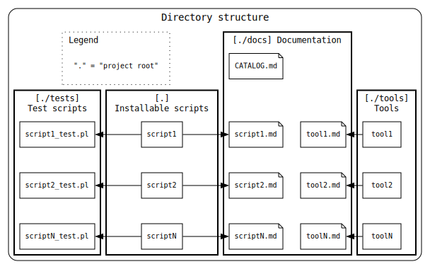

# tomyama_script_collection

自作のスクリプトをまとめたリポジトリです。

配布スクリプト、及びツールの一覧と概要は、 [CATALOG.md](./docs/CATALOG.md) をご覧ください。

* * *

## インストール方法

利用者はインストール方法を選べます。

### 方法 1: `./configure && make install`
```sh
./configure
make install
```
!!! `make install` は、ユーザー環境に応じて `sudo make install` としてください。!!!

### 方法 2: 自分でパスを通す
```sh
git clone https://github.com/username/script_collection.git
cd script_collection/bin
export PATH="$PWD:$PATH"
```

### 方法 3: 手動コピー
お好みの方法で、必要なスクリプトを `$PATH` の通ったディレクトリに配置してください。

```sh
例）
curl -o /usr/local/bin/fill 'url'
chmod +x /usr/local/bin/fill
```

* * *

## テスト

このリポジトリには簡単なテストが含まれています。
Perl モジュール `Test::More`, `Test::Command` などが必要です。

```sh
make check
```

必須ではありませんが、開発や動作確認の際に利用できます。
また、テストを参照する事で、使い方の参考にもなるかもしれません。

* * *

## ディレクトリ構造

配布するスクリプトは、テスト用のスクリプトとドキュメントを持っています。
そして、それらのファイルは、それぞれ、"tests", "docs"ディレクトリに置いています。



"tools"ディレクトリには、このプロジェクトを管理する為のツールが入っています。
例えば、"docs"配下のドキュメントを出力するスクリプト等です。
"tools"ディレクトリのスクリプトは、開発を目的にして作成しました。
ユーザーが意識する必要はありません。

"docs"内のドキュメントの一覧を [CATALOG.md](./docs/CATALOG.md) にまとめています。
最初に参照するドキュメントとしてご利用ください。

* * *

## 開発者向け情報

新しいスクリプトを追加した場合は、`Makefile.am` を編集してください。
autotools の生成物を作り直す場合は以下のコマンドを実行します。

```sh
autoreconf -i
```

その後、通常通り `./configure && make install` でインストールできます。

配布用 tarball を作成するには：

```sh
make dist
```

* * *

## ライセンス

本リポジトリのスクリプトは **BSD 2-Clause License** の下で配布されています。
詳細は [LICENSE](./LICENSE) ファイルをご覧ください。
