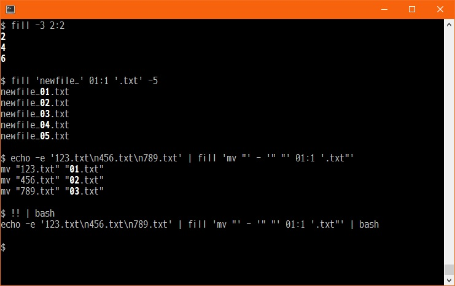
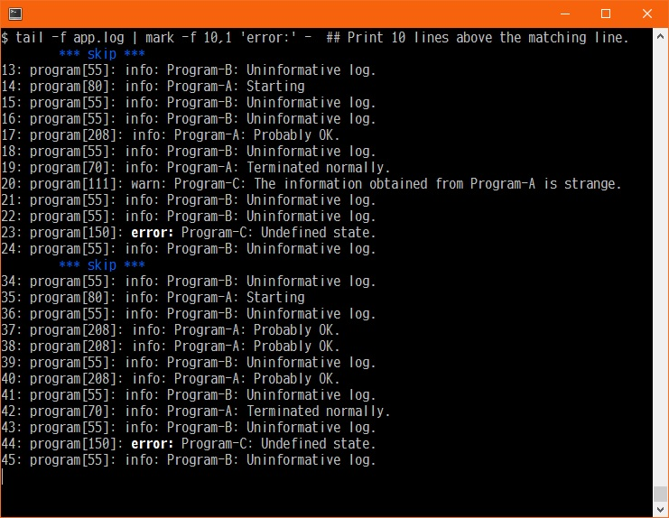

# tomyama_script_collection

自作のスクリプトをまとめたリポジトリです。

* * *

## 配布スクリプト

配布スクリプト、及びツールの一覧と概要は、 [CATALOG.md](./docs/CATALOG.md) をご覧ください。

ここでは画面キャプチャのみ貼付します。

### [c](docs/c.md)

[blog:『計算スクリプト c』の紹介](https://tomyama.hatenablog.jp/entry/2025/11/16/153643)

### [fill](docs/fill.md)


### [mark](docs/mark.md)

[blog: 検索にマッチした行の前後を表示する](https://tomyama.hatenablog.jp/entry/2022/09/29/235346)

* * *

## インストール方法

利用者はインストール方法を選べます。

### 方法 1: `./configure && make install`
```sh
./configure
make install
```
!!! `make install` は、ユーザー環境に応じて `sudo make install` とするか、
システムではなく、ユーザー固有のパスに置くなどの工夫をしてください。 !!!

↓ホームディレクトリのbin配下に置く例。

```sh
./configure --bindir=${HOME}/bin
make install
```

### 方法 2: 自分でパスを通す
```sh
git clone https://github.com/tomyama-code/tomyama_script_collection
cd tomyama_script_collection/bin
export PATH="$PWD:$PATH"
```

### 方法 3: 一部を手動でコピーする
お好みの方法で、必要なスクリプトを `$PATH` の通ったディレクトリに配置してください。

```sh
例）
curl -o /usr/local/bin/fill 'https://raw.githubusercontent.com/tomyama-code/tomyama_script_collection/refs/heads/main/fill'
chmod +x /usr/local/bin/fill
```

* * *

## テスト

このリポジトリには簡単なテストが含まれています。
Perl モジュール `Test::More`, `Test::Command` などが必要です。

```sh
make check
```

必須ではありませんが、開発や動作確認の際に利用できます。
また、テストを参照する事で、使い方の参考にもなるかもしれません。

* * *

## ディレクトリ構造

配布するスクリプトは、テスト用のスクリプトとドキュメントを持っています。
そして、それらのファイルは、それぞれ、"tests", "docs"ディレクトリに置いています。


"tools"ディレクトリには、このプロジェクトを管理する為のツールが入っています。
例えば、"docs"配下のドキュメントを出力するスクリプト等です。
"tools"ディレクトリのスクリプトは、開発を目的にして作成しました。
ユーザーが意識する必要はありません。

"docs"内のドキュメントの一覧を [CATALOG.md](./docs/CATALOG.md) にまとめています。
最初に参照するドキュメントとしてご利用ください。

* * *

## 開発者向け情報

docsディレクトリの [Developer_Manual.md](docs/Developer_Manual.md) を参照してください。

* * *

## ライセンス

本リポジトリのスクリプトは **BSD 2-Clause License** の下で配布されています。
詳細は [LICENSE](./LICENSE) ファイルをご覧ください。


このリポジトリ内の自作スクリプトは BSD 2-Clause ライセンスで公開しています。

なお、GNU Autotools により生成される補助スクリプト
（例: `install-sh`, `missing`, `test-driver` など）が同梱されています。
これらのファイルは、それぞれのファイル先頭に記載されたライセンス
（例: GPL など）に従います。
当リポジトリの BSD 2-Clause ライセンスの対象外です。
