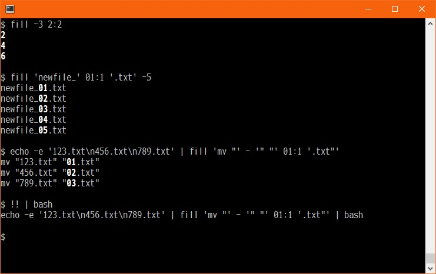
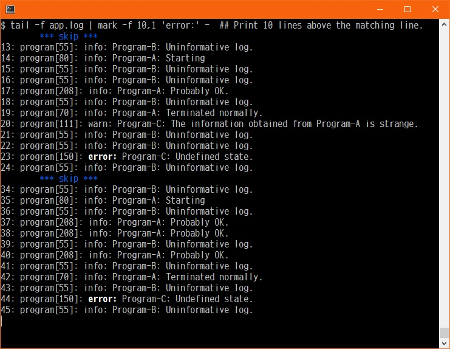

<!--- This file is auto-generated by `make catalog`. Do not edit manually. -->
# Script Catalog

* * *

## Scripts to be installed

### c

The Flat Text Calculator

<< Doctrine of the Flat-Text Faith >>
  - Blessed are the plain, for they shall be grepped.
  - No markup shall obscure the meaning.
  - Let every formula be readable, editable, and eternal.
  - A tool that cannot be piped is not worthy of use.
  - In text we trust.
  - Emojis are evil.
    (They pretend to be text, but they are pictures in disguise.)

- The "c" script displays the result of the given expression.

- Version: 1
- $Revision: 4.46 $

- Script Structure
  - main
    - FormulaEngine
      - FormulaLexer
      - FormulaParser
        - FormulaStack
      - FormulaEvaluator
    - [   Base Package ] OutputFunc
    - [ shared package ] CAppConfig, FormulaToken, TableProvider

- Author: 2025, tomyama
- Intended primarily for personal use, but BSD license permits redistribution.

BSD 2-Clause License:
Copyright (c) 2025, tomyama
All rights reserved.

For details, please refer to [c.md](c.md).

### fill

Generates data row-wise according to a pattern, similar to Excel's AutoFill.

- $Revision: 1.1 $

- Author: 2025, tomyama
- Intended primarily for personal use, but BSD license permits redistribution.

BSD 2-Clause License:
Copyright (c) 2025, tomyama
All rights reserved.

For details, please refer to [fill.md](fill.md).

### mark

emphasizes part matching a pattern

- It behaves like the filter program.
- The back and forth 5 lines are displayed in default.

- $Revision: 1.2 $

- Author: 2006-2025, tomyama
- Intended primarily for personal use, but BSD license permits redistribution.

BSD 2-Clause License:
Copyright (c) 2006-2025, tomyama
All rights reserved.

For details, please refer to [mark.md](mark.md).

* * *

## The script that manages this directory

### tools/build_script.sh

A script that describes the build steps

- A script describing the build steps in an environment
  that uses 'autotools' and 'custom scripts that generate autotools input files'.

- $Revision: 1.4 $

- Author: 2025, tomyama
- Intended primarily for personal use, but BSD license permits redistribution.

BSD 2-Clause License:
Copyright (c) 2025, tomyama
All rights reserved.

For details, please refer to [build_script.sh.md](build_script.sh.md).

### tools/gen_autotools_acam.pl

Generate and manage autotools "ac" and "am" files from a single source.

- Outputs autotools ac and am files based on the data in "GenAutotoolsAcAm_UserFile.pm".
- Eliminates the hassle of adding definitions to multiple files.

- If any files have been updated, it will exit with 0.
- If no files have been updated, it will exit with a value other than 0.

- $Revision: 1.9 $

- Author: 2025, tomyama
- Intended primarily for personal use, but BSD license permits redistribution.

BSD 2-Clause License:
Copyright (c) 2025, tomyama
All rights reserved.

For details, please refer to [gen_autotools_acam.pl.md](gen_autotools_acam.pl.md).

### tools/GenAutotoolsAcAm_UserFile.pm

Define templates and key-value pairs for use with "gen_autotools_acam.pl".

- This package can be edited by the user to form the basis of input files for the autotools.

- $Revision: 2.23 $

- Author: 2025, tomyama
- Intended primarily for personal use, but BSD license permits redistribution.

BSD 2-Clause License:
Copyright (c) 2025, tomyama
All rights reserved.

For details, please refer to [GenAutotoolsAcAm_UserFile.pm.md](GenAutotoolsAcAm_UserFile.pm.md).

### tools/create_CATALOG.sh

Script to generate a catalog of scripts.

- Generates Markdown formatted files in the 'docs' directory.
  - Output documentation from '--help' option or POD
- Generates image files using 'Graphviz'.
  - Outputs svg images from dot files in 'docs'.

- $Revision: 1.8 $

- Tools required for this script
  - Perl 5.10 or later
  - pod2markdown
  - help2man
  - glow
  - Graphviz (using the dot command)

- Author: 2025, tomyama
- Intended primarily for personal use, but BSD license permits redistribution.

BSD 2-Clause License:
Copyright (c) 2025, tomyama
All rights reserved.

For details, please refer to [create_CATALOG.sh.md](create_CATALOG.sh.md).

* * *
- See '[README.md](../README.md)' for installation instructions.
