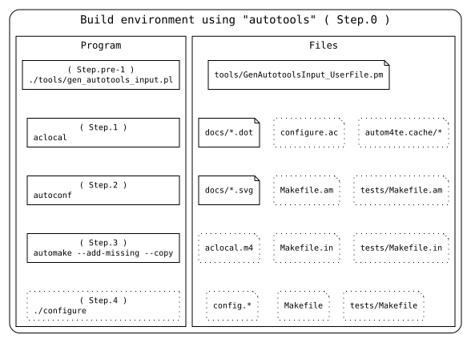
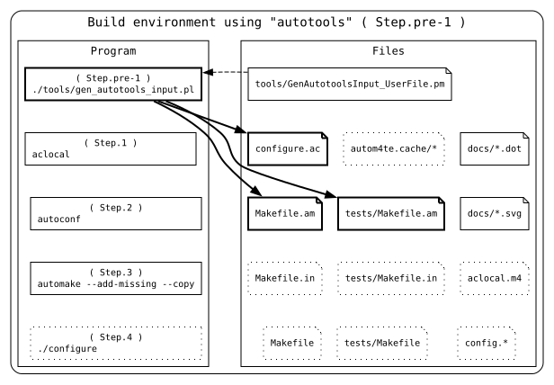
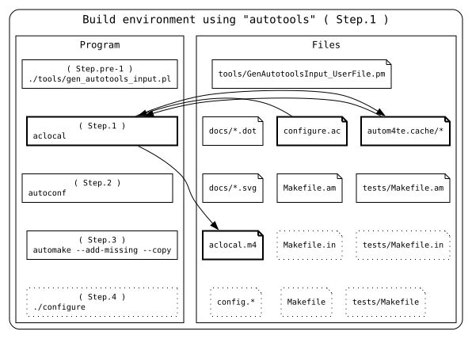
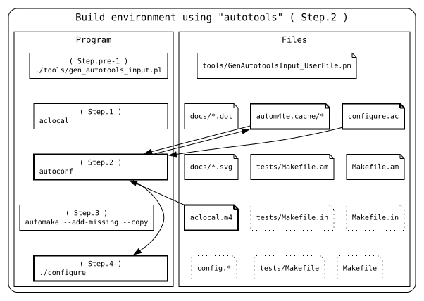
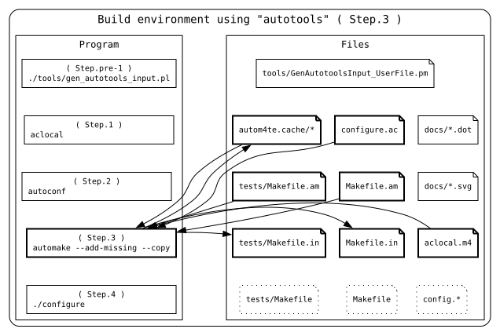
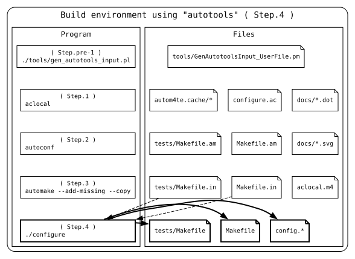

# Developer Manual

この文書は、本リポジトリの**開発者向け手順**をまとめたものです。
利用者（`./configure && make` でビルドするだけの人）は、この文書を読む必要はありません。

---


## 開発方針

- `configure.ac` や `Makefile.am` は **直接編集しない**。
  - テンプレート（自作スクリプトの入力ファイル）から自動生成する。
  - 誤編集を避けることで、ビルド手順の一貫性を保つ。
- autotools 標準のワークフローを踏襲する。
- 初めて clone した人が `./configure && make` でビルドできる状態を維持する。

---


## 開発環境の準備

開発には以下が必要です：

- GNU autotools 一式（`autoconf`, `automake`, `aclocal` など）
- Graphviz
- 本リポジトリ内の自作スクリプト群

ディレクトリ構成については、『[README.md](../README.md)』の「ディレクトリ構造」を参照してください。

---


## 開発ステップ概要

開発の流れは大きく以下の2段階に分かれます。

1. **このリポジトリ特有の前処理**
   - autotools 入力ファイルの生成（`configure.ac` など）

2. **autotools 共通の処理**
   - `aclocal`, `autoconf`, `automake --add-missing --copy`, `./configure` など

---


## ステップごとの手順

### Step 0: Gitリポジトリを clone した状態


---


### Step 0-1: autotools 入力ファイルの生成

`tools/gen_autotools_input.pl`スクリプトを使ってテンプレートから `configure.ac`, `Makefile.am` を生成する。
`configure.ac`, `Makefile.am` を 直接編集する事は禁止。

1. まずは、情報ファイルである、`tools/GenAutotoolsInput_UserFile.pm`を編集する。
2. その後は以下のスクリプトで、`configure.ac`, `Makefile.am` を更新する。

```sh
./tools/gen_autotools_input.pl
```

`tools/GenAutotoolsInput_UserFile.pm` と `tools/gen_autotools_input.pl` の詳細は、[CATALOG.md](CATALOG.md)を確認。
もしくは、直接それぞれのドキュメントを見ることも可能。

- [gen_autotools_input.pl](gen_autotools_input.pl.md)
- [GenAutotoolsInput_UserFile.pm](GenAutotoolsInput_UserFile.pm.md)



---


ここから下は`autotools`の手順に従う。
この手順通りである必要はなくて`autoreconf -i`などを使っても良い。
この説明は、手順を明示するというよりも、【autotoolsがどのステップでどのファイルを生成しているのか？】を整理したかったので作成した。


### Step 1-1: aclocal

aclocal を実行して aclocal.m4 を生成する。

```sh
aclocal
```



---


### Step 1-2: autoconf

autoconf を実行して configure を生成する。

```sh
autoconf
```



---


### Step 1-3: automake

automake --add-missing --copy を実行し、Makefile.in を生成する。
必要に応じて補助スクリプト（install-sh, missing など）が追加される。

```sh
automake --add-missing --copy
```



---


### Step 1-4: configure

./configure を実行して Makefile を生成する。

```sh
./configure
```



---


## テスト方法

[README.md](../README.md) の「テスト」を参照。

---


## 配布用 tarball を作成するには：

```sh
make dist
```

配布用 tarballの作成と同時に、docs配下のドキュメント（Markdown形式）、DOTファイルを画像（SVG形式）に変換する処理も実行される。
図やドキュメントを更新する場合も、`make dist` を利用可能。

アーカイブに含めるファイルの一覧を取得するには：

```sh
make echo-distfiles
```

---


## Markdown形式のドキュメントを更新するには：

docs配下のドキュメント（Markdown形式）の基となるデータはスクリプト内に記述している。

ドキュメントを更新したい場合は：

```sh
make catalog
```

dotファイルを変更した時に図だけを更新したい場合は：

```sh
make docs/img/*.svg
```

---


## 注意事項

編集禁止ファイル

- `configure.ac`
- `Makefile.am`

これらのファイルは、必ず Step 0-1 の手順で生成すること。

## 今後の拡張

- 英語版マニュアル（必要に応じて）

* * *
[README.md](../README.md)
