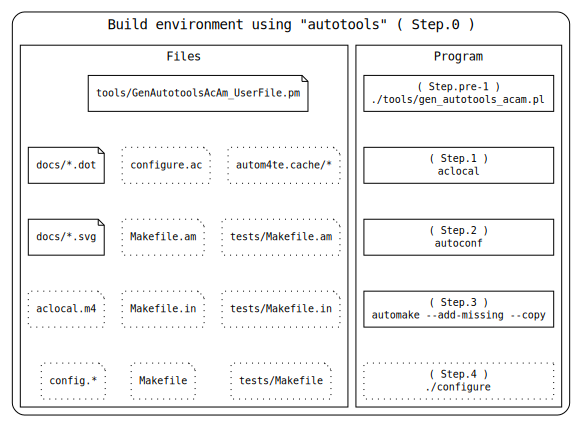
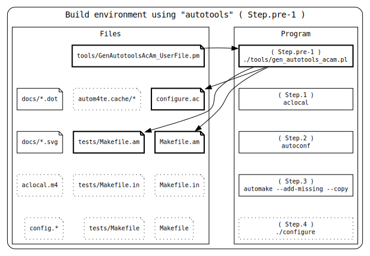
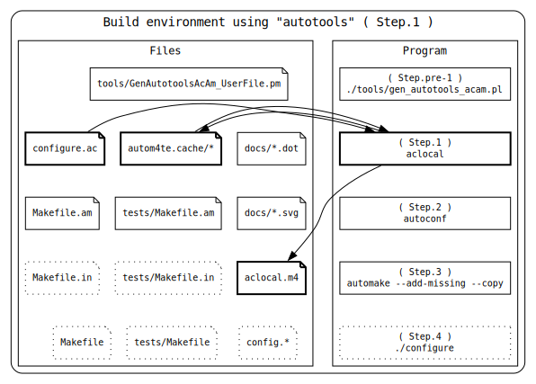
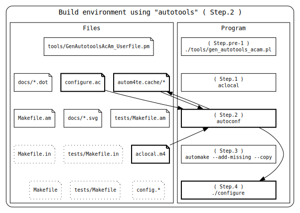
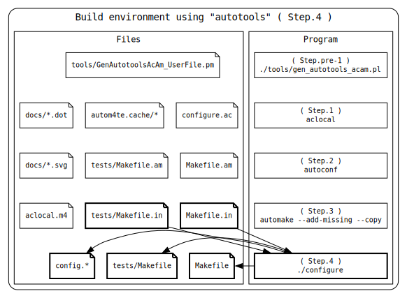

# Developer Manual

この文書は、本リポジトリの**開発者向け手順**をまとめたものです。  
利用者（`./configure && make` でビルドするだけの人）は、この文書を読む必要はありません。

---


## 開発方針

- `configure.ac` や `Makefile.am` は **直接編集しない**。  
  - テンプレート（自作スクリプトの入力ファイル）から自動生成する。  
  - 誤編集を避けることで、ビルド手順の一貫性を保つ。  
- autotools 標準のワークフローを踏襲する。  
- 初めて clone した人が `./configure && make` でビルドできる状態を維持する。  

---


## 開発環境の準備

開発には以下が必要です：

- GNU autotools 一式（`autoconf`, `automake`, `aclocal` など）
- Graphviz
- 本リポジトリ内の自作スクリプト群

ディレクトリ構成については、『[README.md](../README.md)』の「ディレクトリ構造」を参照してください。

---


## 開発ステップ概要

開発の流れは大きく以下の2段階に分かれます。

1. **このリポジトリ特有の前処理**
   - autotools 入力ファイルの生成（`configure.ac` など）

2. **autotools 共通の処理**
   - `aclocal`, `autoconf`, `automake --add-missing --copy`, `./configure` など

---


## ステップごとの手順

### Step 0: リポジトリを clone した状態


---


### Step 0-1: autotools 入力ファイルの生成

自作スクリプトを使ってテンプレートから configure.ac, Makefile.am を生成する。
configure.ac, Makefile.am は 直接編集禁止です。

まずは、大元である、`tools/GenAutotoolsAcAm_UserFile.pm`を編集してください。
その後は以下のスクリプトで、configure.ac, Makefile.am を更新します。

```sh
./tools/gen_autotools_acam.pl
```

`tools/GenAutotoolsAcAm_UserFile.pm` と `tools/gen_autotools_acam.pl` の詳細は、[CATALOG.md](CATALOG.md)を確認してください。
もしくは、直接それぞれのドキュメントを見ることもできます。

- [gen_autotools_acam.pl](gen_autotools_acam.pl.md)
- [GenAutotoolsAcAm_UserFile.pm](GenAutotoolsAcAm_UserFile.pm.md)



---


ここからは下は普通のautotools環境と同様の手順です（configure.ac, Makefile.amを直接編集しない事以外は）。
この手順通りである必要はなくて`autoreconf -i`などを使っても良いです。
どのステップでどのファイルが生成されるのかを整理したかったので作成した図です。


### Step 1-1: aclocal

aclocal を実行して aclocal.m4 を生成する。

```sh
aclocal
```



---


### Step 1-2: autoconf

autoconf を実行して configure を生成する。

```sh
autoconf
```



---


### Step 1-3: automake

automake --add-missing --copy を実行し、Makefile.in を生成する。
必要に応じて補助スクリプト（install-sh, missing など）が追加される。

```sh
automake --add-missing --copy
```


---


### Step 1-4: configure

./configure を実行し、Makefile を生成する。

```sh
./configure
```



---


## テスト方法

[README.md](../README.md) の「テスト」を参照してください。

---


## 配布用 tarball を作成するには：

```sh
make dist
```

---


## 注意事項

編集禁止ファイル

- configure.ac
- Makefile.am

これらは Step 0-1 の手順で生成してください。

## 今後の拡張

- 図の自動更新について  
  現状では、Graphviz の変換処理を Makefile に統合していません。  
  これは、利用者が `make install` しかしない場合に不要な処理であり、  
  また `dot` コマンドが環境にないとエラーになるリスクを避けるためです。  
  （例：`dot` ファイルのタイムスタンプが更新されたことで、意図せず再生成が走るケースなど）
  開発者は必要に応じて `make dist` を実行して図を更新します。
  
- 英語版マニュアル（必要に応じて）

* * *
[README.md](../README.md)
