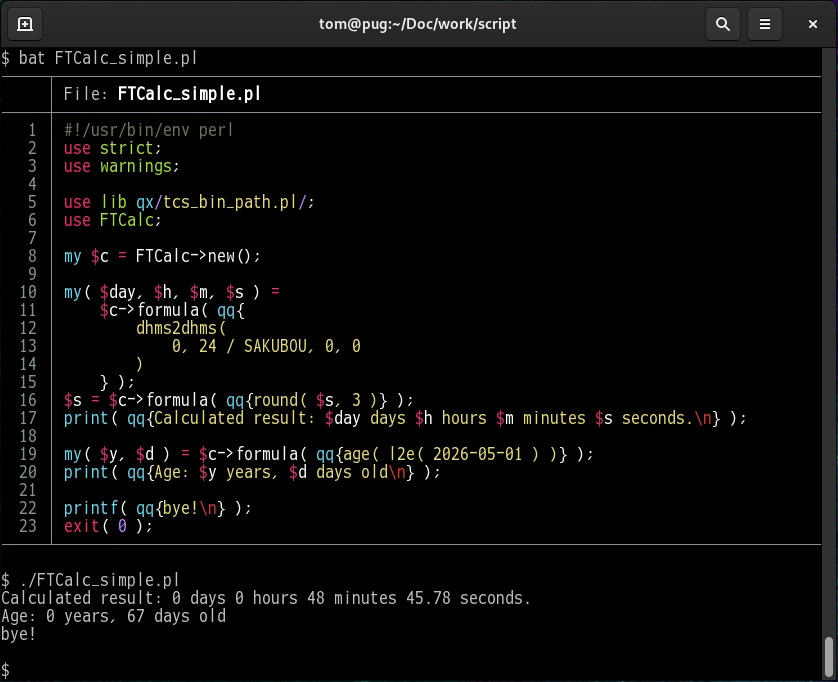

<!--- This file is auto-generated by `make catalog`. Do not edit manually. -->

* * *
# NAME

FTCalc - Perl interface for The Flat-Text Calculator

# SYNOPSIS

    use lib qx/tsc_bin_path.pl/;
    use FTCalc;

    my $c = FTCalc->new();

    my( $day, $h, $m, $s ) =
        $c->formula( qq{
            dhms2dhms(
                0, 24 / SAKUBOU, 0, 0
            )
        } );
    $s = $c->formula( qq{round( $s, 3 )} );
    print( qq{Calculated result: $day days $h hours $m minutes $s seconds.\n} );
    # Calculated result: 0 days 0 hours 48 minutes 45.78 seconds.

# DESCRIPTION

A module that provides an API for manipulating the calculation script "c".

# METHODS

- `new( [ @OPTIONS ] )`

    Creates an instance.
    For @OPTIONS, specify any arguments you wish to pass to the c script.

        my $c = FTCalc->new( '--banner' );

- `formula( $FORMULA [, $SELECTION ] )`

    Executes the specified calculation formula and returns the result.

    Depending on the context and $SELECTION, it can return either a list or a scalar value:

        my( $y, $d ) = $c->formula( qq{age( l2e( 2026-05-01 ) )} );
        print( qq{Age: $y years, $d days old\n} );
        # Age: 0 years, 67 days old

    The optional argument $SELECTION accepts a bitmask combined from the **Formula Selection Constants** below.

    - **Formula Selection Constants**

        The default is `FTC_FSC_FOLLOW_VERBOSE | FTC_FSC_OUTPUT_BOTH`.

        Verbosity Flags:

        - `FTC_FSC_FOLLOW_VERBOSE` (0x01)

            Follows the global verbose setting.

        Output Flags:

        - `FTC_FSC_OUTPUT_FORMULA` (0x10)

            Outputs the calculation formula only.

        - `FTC_FSC_OUTPUT_RESULT` (0x20)

            Outputs the calculation result only.

        - `FTC_FSC_OUTPUT_BOTH` (0x30)

            Outputs both the calculation formula and the result.

    Examples:

    Outputs both the formula and the result, regardless of the verbose output setting:

        my $four = $c->formula( q{1+3}, FTC_FSC_OUTPUT_BOTH );
        # Formula: "1+3"
        #  Result: 4

    Produces no output by passing 0 (clearing all flags), regardless of the verbose setting:

        my $three = $c->formula( q{1+2}, 0 );

    If a calculation that returns a list is evaluated in a scalar context, a reference to the list is returned.

        my $ref_results = $c->formula( qq{dhms2dhms( 0, 3, 45, 12 + 666 )} );
        print( q{resuts: }, join( ', ', @$ref_results ), "\n" );
        # resuts: 0, 3, 56, 18

    Please refer to [the c script documentation](https://github.com/tomyama-code/tomyama_script_collection/blob/main/docs/c.md) for information on the types of calculation formulas you can write.

# FUNCTIONS

- `get_default_value()`

    Get the default value of the module.
    Returns a hash keyed by the setting name.

        my %def_val = &FTCalc::get_default_value();
        printf( qq{def_autoflush is %d\n}, $def_val{def_autoflush} );         # def_autoflush is 1
        printf( qq{def_timeout is %f\n}, $def_val{def_timeout} );             # def_timeout is 0.500000
        printf( qq{def_b_verbose is %d\n}, $def_val{def_b_verbose} );         # def_b_verbose is 0
        printf( qq{def_formula_os is 0x%02X\n}, $def_val{def_formula_os} );   # def_formula_os is 0x31

- `set_default_value( %DEFAULT-VALUES )`

    Sets the default values ​​for the module.
    Specify a hash where the setting names serve as keys.

        my %def_val;
        $def_val{def_autoflush} = 1;
        $def_val{def_timeout} = 3.0;
        $def_val{def_b_verbose} = 1;
        $def_val{def_formula_os} = ( FTC_FSC_FOLLOW_VERBOSE | FTC_FSC_OUTPUT_BOTH );
        &FTCalc::set_default_value( %def_val );

# DEPENDENCIES

This script uses only **core Perl modules**. No external modules from CPAN are required.

## Core Modules Used

- [constant](https://metacpan.org/pod/constant) — first included in perl 5.004
- [File::Basename](https://metacpan.org/pod/File%3A%3ABasename) — first included in perl 5
- [IPC::Open2](https://metacpan.org/pod/IPC%3A%3AOpen2) — first included in perl 5
- [parent](https://metacpan.org/pod/parent) — first included in perl v5.10.1
- [strict](https://metacpan.org/pod/strict) — first included in perl 5
- [Symbol](https://metacpan.org/pod/Symbol) - first included in perl 5.002
- [warnings](https://metacpan.org/pod/warnings) — first included in perl v5.6.0

## Survey methodology

- 1. Preparation

    Define the script name:

        $ target_script=FTCalc.pm

- 2. Extract used modules

    Generate a list of modules from `use` statements:

        $ grep '^use ' $target_script | sed 's!^use \([^ ;{][^ ;{]*\).*$!\1!' | \
            sort | uniq | tee ${target_script}.uselist

- 3. Check core module status

    Run `corelist` for each module to find the first Perl version it appeared in:

        $ cat ${target_script}.uselist | while read line; do
            corelist $line
          done

# SEE ALSO

- [c -- The Flat-Text Calculator (Perl Script)](https://github.com/tomyama-code/tomyama_script_collection/blob/main/docs/c.md)
- [perl(1)](http://man.he.net/man1/perl)

# AUTHOR

2026, tomyama

# LICENSE

Copyright (c) 2026, tomyama

All rights reserved.

Redistribution and use in source and binary forms, with or without
modification, are permitted provided that the following conditions are met:

1\. Redistributions of source code must retain the above copyright notice,
   this list of conditions and the following disclaimer.

2\. Redistributions in binary form must reproduce the above copyright notice,
   this list of conditions and the following disclaimer in the documentation
   and/or other materials provided with the distribution.

3\. Neither the name of tomyama nor the names of its contributors
   may be used to endorse or promote products derived from this software
   without specific prior written permission.

THIS SOFTWARE IS PROVIDED BY THE COPYRIGHT HOLDERS AND CONTRIBUTORS "AS IS"
AND ANY EXPRESS OR IMPLIED WARRANTIES, INCLUDING, BUT NOT LIMITED TO, THE
IMPLIED WARRANTIES OF MERCHANTABILITY AND FITNESS FOR A PARTICULAR PURPOSE ARE
DISCLAIMED. IN NO EVENT SHALL THE COPYRIGHT HOLDER OR CONTRIBUTORS BE LIABLE
FOR ANY DIRECT, INDIRECT, INCIDENTAL, SPECIAL, EXEMPLARY, OR CONSEQUENTIAL
DAMAGES (INCLUDING, BUT NOT LIMITED TO, PROCUREMENT OF SUBSTITUTE GOODS OR
SERVICES; LOSS OF USE, DATA, OR PROFITS; OR BUSINESS INTERRUPTION) HOWEVER
CAUSED AND ON ANY THEORY OF LIABILITY, WHETHER IN CONTRACT, STRICT LIABILITY,
OR TORT (INCLUDING NEGLIGENCE OR OTHERWISE) ARISING IN ANY WAY OUT OF THE USE
OF THIS SOFTWARE, EVEN IF ADVISED OF THE POSSIBILITY OF SUCH DAMAGE.

* * *
- See '[README.md](../README.md)' for installation instructions.
- See '[CATALOG.md](CATALOG.md)' for a list and overview of the scripts.
