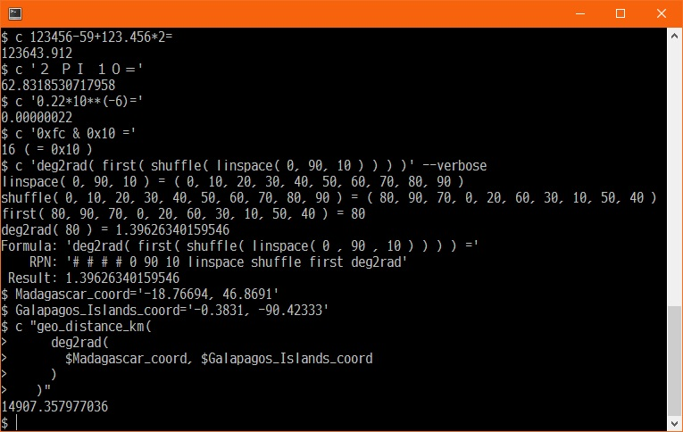

<!--- This file is auto-generated by `make catalog`. Do not edit manually. -->

* * *
# NAME

C - The Flat Text Calculator

# DESCRIPTION

The **c** script displays the result of the given expression.

# SYNOPSIS

$ c \[_OPTIONS..._\] _EXPRESSIONS_

# EXPRESSIONS

## OPERANDS

### Decimal:

0, -1, 100 ...

### Hexadecimal:

0xf, -0x1, 0x0064 ...

### Constant:

- PI

    3.14159265358979

- NOW

    CURRENT-TIME

- User-defined-file

    ".c.rc" should be placed in the same directory as "c script" or in "$HOME".

        [ .c.rc ]
        ## - ".c.rc" should be placed
        ##   in the same directory as "c script" or in "$HOME".
        ##
        ## - "c script" is not case-sensitive.
        ## - All keys are converted to lowercase.
        ## - If you create definitions with different case,
        ##   they will be overwritten by definitions loaded later.

        my %user_constant;

        ## ex.) $ ./c 'geo_distance_km( TOKYO_ST_COORD, OSAKA_ST_COORD )'
        ##      403.505099759608
        $user_constant{TOKYO_ST_COORD} = 'deg2rad( 35.68129, 139.76706 )';
        $user_constant{OSAKA_ST_COORD} = 'deg2rad( 34.70248, 135.49595 )';
        ## ex.) $ ./c 'geo_distance_km( MADAGASCAR_COORD, GALAPAGOS_ISLANDS_COORD )'
        ##      14907.357977036
        $user_constant{MADAGASCAR_COORD} = 'deg2rad( -18.76694, 46.8691 )';
        $user_constant{GALAPAGOS_ISLANDS_COORD} = 'deg2rad( -0.3831, -90.42333 )';

        return %user_constant;

## OPERATORS

\+ - \* / % \*\* | & ^ << >> ~ ( , ) =

## FUNCTIONS

exp, abs, int, floor, ceil, rounddown, round, roundup, percentage, ratio\_scaling, is\_prime,
prime\_factorize, get\_prime, gcd, lcm, ncr, min, max, shuffle, first, slice, uniq, sum, prod, avg,
linspace, linstep, gen\_fibo\_seq, paper\_size, rand, log, sqrt, pow, pow\_inv, rad2deg, deg2rad, dms2rad,
dms2deg, deg2dms, dms2dms, sin, cos, tan, asin, acos, atan, atan2, hypot, slope\_deg, dist\_between\_points,
midpt\_between\_points, angle\_between\_points, geo\_radius, radius\_of\_lat, geo\_distance, geo\_distance\_m,
geo\_distance\_km, is\_leap, age\_of\_moon, local2epoch, gmt2epoch, epoch2local, epoch2gmt, sec2dhms, dhms2sec,
laptimer, stopwatch, bpm, bpm15, bpm30, tachymeter, telemeter, telemeter\_m, telemeter\_km

# OPTIONS

- -d, --debug

        Enable debug output.

- -v, --verbose

        The intermediate steps of the calculation will also be displayed.

- -r, --rpn

        The expression will be displayed in Reverse Polish Notation,
        but the calculation result will not be shown.

        If you want to display the calculation result,
        please use the --verbose option as well.

- -u, --user-defined

    Outputs a list of user-defined values ​​defined in ".c.rc".

- --version

    Print the version of this script and Perl and exit.

- -h, --help

        Display simple help and exit.

# ADVANCED USAGE

## BASIC USE CASE

When you provide a calculation formula, it will display the result.

    $ c 123456-59+123.456*2=
    123643.912

Use parentheses if you want to control the order of operations.

    $ c '123456-(59+123.456)*2='
    123091.088

Using the _-v_ or _--verbose_ option will display the intermediate calculations as well.

    $ c 123456-59+123.456*2= -v
    123456 - 59 = 123397
    123.456 * 2 = 246.912
    123397 + 246.912 = 123643.912
    Formula: '123456 - 59 + 123.456 * 2 ='
        RPN: '123456 59 - 123.456 2 * +'
     Result: 123643.912

You can also specify calculation formulas written in UTF-8.

    $ c １２３，４５６－５９ ＋ １２３．４５６＊２＝
    123643.912

If you simply want to format a mathematical formula that you found on the web,
please use the _-v_ or _--verbose_ option switch.

    $ c '２ ＰＩ １０＝' --verbose
    2 * 3.14159265358979 = 6.28318530717958
    6.28318530717958 * 10 = 62.8318530717958
    Formula: '2 * 3.14159265358979 * 10 ='    <--- HERE
        RPN: '2 3.14159265358979 * 10 *'
     Result: 62.8318530717958

Several functions are also available.

    $ c 'sqrt( power( 1920, 2 ) + power( 1080, 2 ) ) ='
    2202.9071700823

Example of using the functions.

What combinations involve choosing 4 out of 6 ?

    $ c 'nCr( 6, 4 )'
    15

Alternative Method

    $ c 'prod( linstep( 6, -1, 4 ) ) / prod( linstep( 4, -1, 4 ) )' -v
    linstep( 6, -1, 4 ) = ( 6, 5, 4, 3 )
    prod( 6, 5, 4, 3 ) = 360
    linstep( 4, -1, 4 ) = ( 4, 3, 2, 1 )
    prod( 4, 3, 2, 1 ) = 24
    360 / 24 = 15
    Formula: 'prod( linstep( 6 , -1 , 4 ) ) / prod( linstep( 4 , -1 , 4 ) ) ='
        RPN: '# # 6 -1 4 linstep prod # # 4 -1 4 linstep prod /'
     Result: 15

The candidate values ​​are 10 equally spaced values ​​from 0 to 90 degrees,
and the radians of an arbitrarily selected value are calculated.

    $ c 'deg2rad( first( shuffle( linspace( 0, 90, 10 ) ) ) )' -v
    linspace( 0, 90, 10 ) = ( 0, 10, 20, 30, 40, 50, 60, 70, 80, 90 )
    shuffle( 0, 10, 20, 30, 40, 50, 60, 70, 80, 90 ) = ( 10, 80, 60, 40, 30, 90, 50, 70, 20, 0 )
    first( 10, 80, 60, 40, 30, 90, 50, 70, 20, 0 ) = 10
    deg2rad( 10 ) = 0.174532925199433
    Formula: 'deg2rad( first( shuffle( linspace( 0 , 90 , 10 ) ) ) ) ='
        RPN: '# # # # 0 90 10 linspace shuffle first deg2rad'
     Result: 0.174532925199433

If you specify the operands in hexadecimal or use bitwise operators,
the calculation result will also be displayed in hexadecimal.

    # Bitwise AND
    $ c '0xfc & 0x3f'
    60 [ = 0x3C ]

    # Bitwise OR
    $ c '0xfc | 0x3f'
    255 [ = 0xFF ]

    # Bitwise Exclusive OR
    $ c '0xfc ^ 0x3f'
    195 [ = 0xC3 ]

    # Bitwise left shift
    $ c '0x3c << 1'
    120 [ = 0x78 ]

    # Bitwise right shift
    $ c '0x3c >> 1'
    30 [ = 0x1E ]

    # Bitwise Inversion
    $ c '~0x1 & 0x3f'
    62 [ = 0x3E ]

There is no option switch to display the calculation results in hexadecimal.
However, you can display it by performing a bitwise '_|\[OR\]_' operation with 0.

    $ c '100|0'
    100 [ = 0x64 ]

\[ radical (of n) \] Eliminate duplicates of each prime factor and take the product:

    ## Factorize any given number into prime factors...
    $ c 'prime_factorize( 4428 )'
    ( 2, 2, 3, 3, 3, 41 )

    ## Eliminate duplicates...
    $ c 'uniq( prime_factorize( 4428 ) )'
    ( 2, 3, 41 )

    ## Take the product of each value
    $ c 'prod( uniq( prime_factorize( 4428 ) ) )'
    246

You can also:

    ## Generate prime numbers in 16-bit width
    $ c 'prod( get_prime( 16 ), get_prime( 16 ) )'
    1691574281

    ## check
    $ c 'pf( 1691574281 )|0'  ## pf() is an alias for prime_factorize().
    ( 29303, 57727 ) [ = ( 0x7277, 0xE17F ) ]

## STANDARD INPUT (STDIN) MODE

If no calculation formula is specified as an argument,
the program will wait for input from STDIN.
To exit, send an End Of File signal (for example, press Ctrl + D).

    $ c
    ^D

Example of running with the _-v_ or _--verbose_ option:

    $ c --verbose
    0.22*10**(-6)=    <-- INPUT FROM KEYBOARD
    10 ** -6 = 1e-06
    0.22 * 1e-06 = 2.2e-07
    Formula: '0.22 * 10 ** ( -6 ) ='
        RPN: '0.22 10 -6 ** *'
     Result: 0.00000022 [ = 2.2e-07 ]
    <-- INPUT FROM KEYBOARD

    sqrt(2)=    <-- INPUT FROM KEYBOARD
    sqrt( 2 ) = 1.4142135623731
    Formula: 'sqrt( 2 ) ='
        RPN: '# 2 sqrt'
     Result: 1.4142135623731
    ^D    <-- INPUT FROM KEYBOARD

By constructing the calculation formula first,
you can easily repeat similar calculations.
For example, when using **sed**:

    $ cat - | sed -u 's/^\(.*\)$/round( (\1+0) * 1.1 , 0 ) =/'
    1028    <-- INPUT FROM KEYBOARD
    round( (1028+0) * 1.1 , 0 ) =
    <-- INPUT FROM KEYBOARD
    round( (+0) * 1.1 , 0 ) =
    ^D    <-- INPUT FROM KEYBOARD

The formula looks fine, so let's pipe it into the _c_ script:

    $ !! | c
    cat - | sed -u 's/^\(.*\)$/round( (\1+0) * 1.1 , 0 ) =/' | c
    1000
    1100    <-- RESULT
    500
    550     <-- RESULT
    998
    1098    <-- RESULT
    ^D

It might be convenient to register it as an alias:

    ex.) ~/.bashrc
    alias ctax="cat - | sed -u 's/^\(.*\)$/round( (\1+0) * 1.1 , 0 ) =/' | c"

## TIME CALCULATIONS

Current time in seconds since the epoch:

    $ c now
    1764003197

In an easy-to-understand format:

    $ c 'epoch2local( now )'
    ( 2025, 11, 25, 1, 53, 17 )   # 2025-11-25 01:53:17

Time elapsed since a specified date:

    $ c 'sec2dhms( now - local2epoch( 2011, 03, 11, 14, 46 ) )'
    ( 5372, 15, 51, 18 )  # 5372 days, 15 hours, 51 minutes, and 18 seconds

Time interval:

    $ c 'sec2dhms( local2epoch( 2024, 01, 01, 16, 10 ) - local2epoch( 2011, 03, 11, 14, 46 ) )'
    ( 4679, 1, 24, 0 )

1 hour and 45 minutes before two days later:

    $ c 'epoch2local( local2epoch( 2020, 1, 1, 15, 0, 0 ) + dhms2sec( 2, -1, -45 ) )'
    ( 2020, 1, 3, 13, 15, 0 )

If it takes 1 hour and 18 minutes to make 3, when will 15 be completed?:

    $ c 'epoch2local(
           local2epoch( 2025, 11, 25, 09, 00 ) +
           ratio_scaling( 3, dhms2sec( 0, 1, 18 ), 15 )
         )'
    ( 2025, 11, 25, 15, 30, 0 )

## COORDINATE CALCULATION

I think this is a feature that anyone who likes looking at maps will want to use.

Here we use the following coordinates (latitude and longitude):

    ex)
    Madagascar:        degrees: -18.76694, 46.8691
    Galapagos Islands: degrees: -0.3831, -90.42333

Calculate the distance between two points.

    $ c 'geo_distance_km(
           deg2rad( -18.76694, 46.8691 ),
           deg2rad( -0.3831, -90.42333 )
         ) ='
    14907.357977036

The straight-line distance between Madagascar and the Galapagos Islands was found to be 14,907 km.

If you want to specify latitude and longitude in DMS, use dms2rad().
Be sure to include the sign if the value is negative.

    # gd_km() is an alias for geo_distance_km().
    $ c 'gd_km(
           dms2rad( -18, -46,  -0.984000000006233 ), dms2rad( 46, 52, 8.76000000001113 ),
           dms2rad(  -0, -22, -59.16 ), dms2rad( -90, -25, -23.9880000000255 ) ) ='
    14907.357977036

If you record the calculation as shown below,
you can save not only the calculation results but also the calculation method,
which I think will be easy to reuse and convenient.
This is one of the reasons why I wrote this tool.

    $ Madagascar_coord='-18.76694, 46.8691'
    $ Galapagos_Islands_coord='-0.3831, -90.42333'
    $ c "geo_distance_km(
           deg2rad(
             $Madagascar_coord, $Galapagos_Islands_coord
           )
         )"
    14907.357977036
    $

The **c** script was created with the following in mind:

\- It will run with just Perl.

\- The calculation formulas are easy to understand even when read later.

# OPERATORS

- `+`

    Addition. `1 + 2` -> `3`.

- `-`

    Subtraction. `3 - 2` -> `1`.

- `*`

    Multiplication. `1 * 2` -> `2`.

- `/`

    Division. `1 / 2` -> `0.5`.

- `%`

    Modulo arithmetic. `5 % 3` -> `2`.

- `**`

    Exponentiation. `2 ** 3` -> `8`. Similarly, `pow( 2, 3 )`.

- `|`

    Bitwise OR. `0x2 | 0x4` -> `6 [ = 0x6 ]`.

- `&`

    Bitwise AND. `0x6 & 0x4` -> `4 [ = 0x4 ]`.

- `^`

    Bitwise Exclusive OR. `0x6 ^ 0x4` -> `2 [ = 0x2 ]`.

- `<<`

    Bitwise left shift. `0x6 << 1` -> `12 [ = 0xC ]`.

- `>>`

    Bitwise right shift. `0x6 >> 1` -> `3 [ = 0x3 ]`.

- `~`

    Bitwise Inversion. `~0` -> `0xFFFFFFFFFFFFFFFFFF`.

- `(`

    A symbol that controls the priority of calculations.

- `,`

    The separator that separates function arguments.

- `)`

    A symbol that controls the priority of calculations.

- `=`

    Equals sign. In _c_ script, it has the meaning of terminating the calculation formula,
    but it is not necessary. `1 + 2 =`. Similarly, `1 + 2`.

# FUNCTIONS

- `exp`

    exp( _N_ ). Returns e (the natural logarithm base) to the power of _N_. \[Perl Native\]

- `abs`

    abs( _N_ ). Returns the absolute value of its argument. \[Perl Native\]

- `int`

    int( _N_ ). Returns the integer portion of _N_. \[Perl Native\]

- `floor`

    floor( _N_ ). Returning the largest integer value less than or equal to the numerical argument. \[POSIX\]

- `ceil`

    ceil( _N_ ). Returning the smallest integer value greater than or equal to the given numerical argument. \[POSIX\]

- `rounddown`

    rounddown( _A_, _B_ ). Returns the value of _A_ truncated to _B_ decimal places.

- `round`

    round( _A_, _B_ ). Returns the value of _A_ rounded to _B_ decimal places.

- `roundup`

    roundup( _A_, _B_ ). Returns the value of _A_ rounded up to _B_ decimal places.

- `percentage`

    percentage( _NUMERATOR_, _DENOMINATOR_ \[, _DECIMAL\_PLACES_ \] ). Returns the percentage, rounding the number if _DECIMAL\_PLACES_ is specified. alias: pct().

- `ratio_scaling`

    ratio\_scaling( _A_, _B_, _C_ \[, _DECIMAL\_PLACES_ \] ). When _A_:_B_, return the value of _X_ in _A_:_B_=_C_:_X_. Rounding the number if _DECIMAL\_PLACES_ is specified. alias: rs().

- `is_prime`

    is\_prime( _NUM_ ). Prime number test. Returns 1 if _NUM_ is prime, otherwise returns 0.

- `prime_factorize`

    prime\_factorize( _NUM_ ). Do prime factorization. _NUM_ is an integer greater than or equal to 2. alias: pf().

- `get_prime`

    get\_prime( _BIT\_WIDTH_ ). Returns a random prime number within the range of _BIT\_WIDTH_, where _BIT\_WIDTH_ is an integer between 4 and 32, inclusive.

- `gcd`

    gcd( _NUMBER1_,.. ). Returns the greatest common divisor (GCD), which is the largest positive integer that divides each of the operands. \[Math::BigInt::bgcd()\]

- `lcm`

    lcm( _NUMBER1_,.. ). Returns the least common multiple (LCM). \[Math::BigInt::blcm()\]

- `ncr`

    nCr( _N_, _R_ ). _N_ Choose _R_. A combination of _R_ items selected from _N_ items. _N_ is a non-negative integer. _R_ is a positive integer.

- `min`

    min( _NUMBER1_,.. ). Returns the entry in the list with the lowest numerical value. \[List::Util\]

- `max`

    max( _NUMBER1_,.. ). Returns the entry in the list with the highest numerical value. \[List::Util\]

- `shuffle`

    shuffle( _NUMBER1_,.. ). Returns the values of the input in a random order. \[List::Util\]

- `first`

    first( _NUMBER1_,.. ). Returns the head of the set. Same as slice( _NUMBER1_,.. , 0, 1 ).

- `slice`

    slice( _NUMBER1_,.., _OFFSET_, _LENGTH_ ). Extracts elements specified by _OFFSET_ and _LENGTH_ from a set.

- `uniq`

    uniq( _NUMBER1_,.. ). Filters a list of values to remove subsequent duplicates, as judged by a DWIM-ish string equality or "undef" test. Preserves the order of unique elements, and retains the first value of any duplicate set. \[List::Util\]

- `sum`

    sum( _NUMBER1_,.. ). Returns the numerical sum of all the elements in the list. \[List::Util\]

- `prod`

    prod( _NUMBER1_,.. ). Returns the product of each value.

- `avg`

    avg( _NUMBER1_,.. ). Returns the average value of all elements in a list.

- `linspace`

    linspace( _LOWER_, _UPPER_, _COUNT_ \[, _DECIMAL\_PLACES_ \] ).
    Generates a list of numbers from _LOWER_ to _UPPER_ divided into equal intervals by _COUNT_.
    Rounding the number if _DECIMAL\_PLACES_ is specified.

    Divide the range from 0x33 to 0xCC into 5 parts:

        $ c 'linspace( 0x33, 0xcc, 5, 0 )'
        ( 51, 89, 128, 166, 204 ) [ = ( 0x33, 0x59, 0x80, 0xA6, 0xCC ) ]

- `linstep`

    linstep( _START_, _STEP_, _COUNT_ ).
    Generates a list of _COUNT_ numbers that increase from _START_ by _STEP_.

- `gen_fibo_seq`

    gen\_fibo\_seq( _A_, _B_, _COUNT_ ).
    Generates the Generalized Fibonacci Sequence. _COUNT_ is a non-negative integer.
    Returns an array starting at _A_ and _B_, with size _COUNT_ + 2.

    Generate the Lucas sequence:

        $ c 'gen_fibo_seq( 2, 1, 10 )'
        ( 2, 1, 3, 4, 7, 11, 18, 29, 47, 76, 123, 199 )

- `paper_size`

    paper\_size( SIZE \[, TYPE \] ).
    Returns the following information in this order:
    length of short side, length of long side (in mm), area (in mm2).
    SIZE is a non-negative integer.
    If TYPE is omitted or 0 is specified, it will be A size.
    If TYPE is specified as 1, it will be B size.

    What are the dimensions of A4 size?:

        $ c 'paper_size( 4 )'
        ( 210, 297, 62370 )

- `rand`

    rand( _N_ ).  Returns a random fractional number greater than or equal to 0 and
    less than the value of _N_. \[Perl Native\]

- `log`

    log( _N_ ). Returns the natural logarithm (base e) of _N_. \[Perl Native\]

- `sqrt`

    sqrt( _N_ ). Return the positive square root of _N_. Works only for non-negative operands. \[Perl Native\]

- `pow`

    pow( _A_, _B_ ). Exponentiation. "pow( 2, 3 )" -> 8. Similarly, "2 \*\* 3". \[Perl Native\]

- `pow_inv`

    pow\_inv( _A_, _B_ ). Returns the power of _A_ to which _B_ is raised.

- `rad2deg`

    rad2deg( _RADIANS_ \[, _RADIANS_..\] ) -> ( _DEGREES_ \[, _DEGREES_..\] ). \[Math::Trig\]

- `deg2rad`

    deg2rad( _DEGREES_ \[, _DEGREES_..\] ) -> ( _RADIANS_ \[, _RADIANS_..\] ). \[Math::Trig\]

- `dms2rad`

    dms2rad( _DEG_, _MIN_, _SEC_ \[, _DEG_, _MIN_, _SEC_ ..\] ) -> ( _RADIANS_ \[, _RADIANS_..\] ).

- `dms2deg`

    dms2deg( _DEG_, _MIN_, _SEC_ \[, _DEG_, _MIN_, _SEC_ ..\] ) -> ( _DEGREES_ \[, _DEGREES_..\] ).

- `deg2dms`

    deg2dms( _DEGREES_ \[, _DEGREES_..\] ) -> ( _DEG_, _MIN_, _SEC_ \[, _DEG_, _MIN_, _SEC_ ..\] ).

- `dms2dms`

    dms2dms( _DEG_, _MIN_, _SEC_ \[, _DEG_, _MIN_, _SEC_ ..\] ) -> ( _DEG_, _MIN_, _SEC_ \[, _DEG_, _MIN_, _SEC_ ..\] ).

- `sin`

    sin( _RADIANS_ ). Returns the sine of _RADIANS_. \[Perl Native\]

- `cos`

    cos( _RADIANS_ ). Returns the cosine of _RADIANS_. \[Perl Native\]

- `tan`

    tan( _RADIANS_ ). Returns the tangent of _RADIANS_. \[Math::Trig\]

- `asin`

    asin( _RATIO_ ). The arcus (also known as the inverse) functions of the sine. \[Math::Trig\]

- `acos`

    acos( _RATIO_ ). The arcus (also known as the inverse) functions of the cosine. \[Math::Trig\]

- `atan`

    atan( _RATIO_ ). The arcus (also known as the inverse) functions of the tangent. \[Math::Trig\]

- `atan2`

    atan2( _Y_, _X_ ). The principal value of the arc tangent of _Y_ / _X_. \[Math::Trig\]

- `hypot`

    hypot( _X_, _Y_ ). Equivalent to "sqrt( _X_ \* _X_ + _Y_ \* _Y_ )" except more stable on very large or very small arguments. \[POSIX\]

- `slope_deg`

    slope\_deg( _X_, _Y_ ). Returns the straight line distance from (0,0) to (_X_,_Y_).

- `dist_between_points`

    dist\_between\_points( _X1_, _Y1_, _X2_, _Y2_ ) or dist\_between\_points( _X1_, _Y1_, _Z1_, _X2_, _Y2_, _Z2_ ). Returns the straight-line distance from (_X1_,_Y1_) to (_X2_,_Y2_) or from (_X1_,_Y1_,_Z1_) to (_X2_,_Y2_,_Z2_). alias: dist().

- `midpt_between_points`

    midpt\_between\_points( _X1_, _Y1_, _X2_, _Y2_ ) or midpt\_between\_points( _X1_, _Y1_, _Z1_, _X2_, _Y2_, _Z2_ ). Returns the coordinates of the midpoint between (_X1_,_Y1_) and (_X2_,_Y2_), or (_X1_,_Y1_,_Z1_) and (_X2_,_Y2_,_Z2_). alias: midpt().

- `angle_between_points`

    angle\_between\_points( _X1_, _Y1_, _X2_, _Y2_ ) or angle\_between\_points( _X1_, _Y1_, _Z1_, _X2_, _Y2_, _Z2_ ). Returns the angle (in degrees) from (_X1_,_Y1_) to (_X2_,_Y2_) or from (_X1_,_Y1_,_Z1_) to (_X2_,_Y2_,_Z2_). alias: angle().

- `geo_radius`

    geo\_radius( _LAT_ ). Given a latitude (in radians), returns the distance from the center of the Earth to its surface (in meters).

- `radius_of_lat`

    radius\_of\_lat( _LAT_ ). Given a latitude (in radians), returns the radius of that parallel (in meters).

- `geo_distance`

    geo\_distance( _A\_LAT_, _A\_LON_, _B\_LAT_, _B\_LON_ ). Calculates and returns the distance (in meters) from _A_ to _B_. Latitude and longitude must be specified in radians. Same as geo\_distance\_m().

- `geo_distance_m`

    geo\_distance\_m( _A\_LAT_, _A\_LON_, _B\_LAT_, _B\_LON_ ). Calculates and returns the distance (in meters) from _A_ to _B_. Latitude and longitude must be specified in radians. Same as geo\_distance(). alias: gd\_m().

- `geo_distance_km`

    geo\_distance\_km( _A\_LAT_, _A\_LON_, _B\_LAT_, _B\_LON_ ). Calculates and returns the distance (in kilometers) from _A_ to _B_. Latitude and longitude must be specified in radians. Same as geo\_distance\_m() / 1000. alias: gd\_km().

- `is_leap`

    is\_leap( _YEAR_ ). Leap year test: Returns 1 if _YEAR_ is a leap year, 0 otherwise.

- `age_of_moon`

    age\_of\_moon( _Y_, _m_, _d_ ). Simple calculation of the age of the moon. Maximum deviation of about 2 days.

- `local2epoch`

    local2epoch( _Y_, _m_, _d_ \[, _H_, _M_, _S_ \] ). Returns the local time in seconds since the epoch.

- `gmt2epoch`

    gmt2epoch( _Y_, _m_, _d_ \[, _H_, _M_, _S_ \] ). Returns the GMT time in seconds since the epoch.

- `epoch2local`

    epoch2local( _EPOCH_ ). Returns the local time. ( _Y_, _m_, _d_, _H_, _M_, _S_ ).

- `epoch2gmt`

    epoch2gmt( _EPOCH_ ). Returns the GMT time. ( _Y_, _m_, _d_, _H_, _M_, _S_ ).

- `sec2dhms`

    sec2dhms( _DURATION\_SEC_ ) --Convert-to--> ( _D_, _H_, _M_, _S_ ).

- `dhms2sec`

    dhms2sec( _D_ \[, _H_, _M_, _S_ \] ) --Convert-to--> ( _DURATION\_SEC_ ).

- `laptimer`

    laptimer( _LAPS_ ). Each time you press Enter, the split time is measured and the time taken to measure _LAPS_ is returned. If _LAPS_ is set to a negative value, the split time is not output. alias: lt().

- `stopwatch`

    stopwatch( _B\_PRINT_ ). Measures the time until the Enter key is pressed. If you specify 0 for _B\_PRINT_, the measured time will not be displayed on the screen. alias: sw().

- `bpm`

    bpm( _B\_PRINT_, _COUNT_ ). Once you have confirmed the _COUNT_ number of beats, press the Enter key. The BPM will be calculated from the elapsed time. If you specify 0 for _B\_PRINT_, the measured time will not be displayed on the screen.

- `bpm15`

    bpm15( _B\_PRINT_ ). Once you have confirmed 15 beats, press the Enter key. The BPM will be calculated from the elapsed time. If you specify 0 for _B\_PRINT_, the measured time will not be displayed on the screen.

- `bpm30`

    bpm30( _B\_PRINT_ ). Once you have confirmed 30 beats, press the Enter key. The BPM will be calculated from the elapsed time. If you specify 0 for _B\_PRINT_, the measured time will not be displayed on the screen.

- `tachymeter`

    tachymeter( _B\_PRINT_ ). Measures the number of seconds required for one unit of work and returns the number of units of work done per hour. Press Enter to measure the number of seconds. If you specify 0 for _B\_PRINT_, the measured time will not be displayed on the screen. Same as ratio\_scaling( stopwatch( _B\_PRINT_ ), 1, 3600 ).

- `telemeter`

    telemeter( _SECOND_ ). Measures distance using the difference in the speed of light and sound. Returns the distance equivalent to _SECOND_ in meters. Same as telemeter\_m().

- `telemeter_m`

    telemeter\_m( _SECOND_ ). Measures distance using the difference in the speed of light and sound. Returns the distance equivalent to _SECOND_ in meters. Same as telemeter().

- `telemeter_km`

    telemeter\_km( _SECOND_ ). Measures distance using the difference in the speed of light and sound. Returns the distance equivalent to _SECOND_ in kilometers. Same as telemeter\_m() / 1000.

# Environmental requirements

## List of modules used

- base - first included in perl 5.00405
- Class::Struct — first included in perl 5.004
- constant — first included in perl 5.004
- Encode — first included in perl v5.7.3
- File::Basename — first included in perl 5
- List::Util — first included in perl v5.7.3
- Math::BigInt — first included in perl 5
- Math::Trig — first included in perl 5.004
- POSIX — first included in perl 5
- strict — first included in perl 5
- Time::HiRes - first included in perl v5.7.3
- Time::Local - first included in perl 5
- utf8 — first included in perl v5.6.0
- warnings — first included in perl v5.6.0

## Survey methodology

\- Preparation:

    $ target_script=c

\- 1st. column:

    $ grep '^use ' $target_script | sed 's!^use \([^ ;{][^ ;{]*\).*$!\1!' | \
        sort | uniq | tee ${target_script}.uselist

\- 2nd. column:

    $ cat ${target_script}.uselist | while read line; do
        corelist $line
      done

# SEE ALSO

- [perl](https://metacpan.org/pod/perl)(1)
- [List::Util](https://metacpan.org/pod/List%3A%3AUtil)
- [Math::BigInt](https://metacpan.org/pod/Math%3A%3ABigInt)
- [Math::Trig](https://metacpan.org/pod/Math%3A%3ATrig)
- [POSIX](https://metacpan.org/pod/POSIX)
- [Time::HiRes](https://metacpan.org/pod/Time%3A%3AHiRes)
- [Time::Local](https://metacpan.org/pod/Time%3A%3ALocal)

# AUTHOR

2025, tomyama

# LICENSE

Copyright (c) 2025, tomyama

All rights reserved.

Redistribution and use in source and binary forms, with or without
modification, are permitted provided that the following conditions are met:

1\. Redistributions of source code must retain the above copyright notice,
   this list of conditions and the following disclaimer.
2\. Redistributions in binary form must reproduce the above copyright notice,
   this list of conditions and the following disclaimer in the documentation
   and/or other materials provided with the distribution.
3\. Neither the name of tomyama nor the names of its contributors
   may be used to endorse or promote products derived from this software
   without specific prior written permission.

THIS SOFTWARE IS PROVIDED BY THE COPYRIGHT HOLDERS AND CONTRIBUTORS "AS IS"
AND ANY EXPRESS OR IMPLIED WARRANTIES, INCLUDING, BUT NOT LIMITED TO, THE
IMPLIED WARRANTIES OF MERCHANTABILITY AND FITNESS FOR A PARTICULAR PURPOSE ARE
DISCLAIMED. IN NO EVENT SHALL THE COPYRIGHT HOLDER OR CONTRIBUTORS BE LIABLE
FOR ANY DIRECT, INDIRECT, INCIDENTAL, SPECIAL, EXEMPLARY, OR CONSEQUENTIAL
DAMAGES (INCLUDING, BUT NOT LIMITED TO, PROCUREMENT OF SUBSTITUTE GOODS OR
SERVICES; LOSS OF USE, DATA, OR PROFITS; OR BUSINESS INTERRUPTION) HOWEVER
CAUSED AND ON ANY THEORY OF LIABILITY, WHETHER IN CONTRACT, STRICT LIABILITY,
OR TORT (INCLUDING NEGLIGENCE OR OTHERWISE) ARISING IN ANY WAY OUT OF THE USE
OF THIS SOFTWARE, EVEN IF ADVISED OF THE POSSIBILITY OF SUCH DAMAGE.

* * *
- See '[README.md](../README.md)' for installation instructions.
- See '[CATALOG.md](CATALOG.md)' for a list and overview of the scripts.
