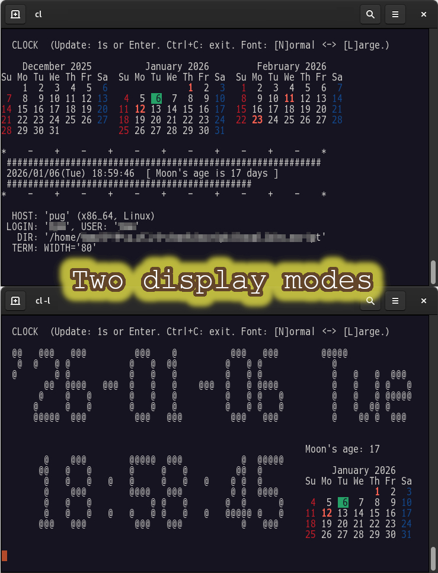

<!--- This file is auto-generated by `make catalog`. Do not edit manually. -->

* * *
# NAME

CL - CLOCK PROGRAM

# DESCRIPTION

This is a clock script.

A clock script created to act as a Keep-Alive mechanism,
preventing TCP session timeouts during remote work.

## Supports two display modes:

- Normal Mode:

    Displays time in plain text. (default)

- Large Font Mode (`-l`):

    Displays time in large ASCII art, similar to the `banner` command.

## Interactive Commands (during execution):

- `Ctrl` + `C`

    Exit

- `L` + `Enter`

    Switch to Large Font Mode

- `N` + `Enter`

    Switch to Normal Mode

- `INTERVAL` + `Enter`

    Update interval in seconds (1-60)

- `Enter`

    Refresh the display immediately

# SYNOPSIS

$ cl \[_OPTIONS..._\] \[_ARGUMENTS_\]

# OPTIONS

- -l

    Enable Large Font Mode (ASCII art).

- -v, --version

    Display script version, Perl version, and exit.

- -h, --help

    Display simple help and exit.

# ARGUMENTS

- INTERVAL

    Update interval in seconds (1-60). Default is 1.

# DEPENDENCIES

This script uses only **core Perl modules**. No external modules from CPAN are required.

## Core Modules Used

- [constant](https://metacpan.org/pod/constant) — first included in perl 5.004
- [File::Basename](https://metacpan.org/pod/File%3A%3ABasename) — first included in perl 5
- [POSIX](https://metacpan.org/pod/POSIX) — first included in perl 5
- [strict](https://metacpan.org/pod/strict) — first included in perl 5
- [Time::HiRes](https://metacpan.org/pod/Time%3A%3AHiRes) - first included in perl v5.7.3
- [Time::Local](https://metacpan.org/pod/Time%3A%3ALocal) - first included in perl 5
- [warnings](https://metacpan.org/pod/warnings) — first included in perl v5.6.0

## Survey methodology

- 1. Preparation

    Define the script name:

        $ target_script=cl

- 2. Extract used modules

    Generate a list of modules from `use` statements:

        $ grep '^use ' $target_script | sed 's!^use \([^ ;{][^ ;{]*\).*$!\1!' | \
            sort | uniq | tee ${target_script}.uselist

- 3. Check core module status

    Run `corelist` for each module to find the first Perl version it appeared in:

        $ cat ${target_script}.uselist | while read line; do
            corelist $line
          done

# SEE ALSO

- [perl](https://metacpan.org/pod/perl)(1)
- [constant](https://metacpan.org/pod/constant)
- [File::Basename](https://metacpan.org/pod/File%3A%3ABasename)
- [POSIX](https://metacpan.org/pod/POSIX)
- [strict](https://metacpan.org/pod/strict)
- [Time::HiRes](https://metacpan.org/pod/Time%3A%3AHiRes)
- [Time::Local](https://metacpan.org/pod/Time%3A%3ALocal)
- [warnings](https://metacpan.org/pod/warnings)

# AUTHOR

2005-2026, tomyama

# LICENSE

Copyright (c) 2005-2026, tomyama

All rights reserved.

Redistribution and use in source and binary forms, with or without
modification, are permitted provided that the following conditions are met:

1\. Redistributions of source code must retain the above copyright notice,
   this list of conditions and the following disclaimer.
2\. Redistributions in binary form must reproduce the above copyright notice,
   this list of conditions and the following disclaimer in the documentation
   and/or other materials provided with the distribution.
3\. Neither the name of tomyama nor the names of its contributors
   may be used to endorse or promote products derived from this software
   without specific prior written permission.

THIS SOFTWARE IS PROVIDED BY THE COPYRIGHT HOLDERS AND CONTRIBUTORS "AS IS"
AND ANY EXPRESS OR IMPLIED WARRANTIES, INCLUDING, BUT NOT LIMITED TO, THE
IMPLIED WARRANTIES OF MERCHANTABILITY AND FITNESS FOR A PARTICULAR PURPOSE ARE
DISCLAIMED. IN NO EVENT SHALL THE COPYRIGHT HOLDER OR CONTRIBUTORS BE LIABLE
FOR ANY DIRECT, INDIRECT, INCIDENTAL, SPECIAL, EXEMPLARY, OR CONSEQUENTIAL
DAMAGES (INCLUDING, BUT NOT LIMITED TO, PROCUREMENT OF SUBSTITUTE GOODS OR
SERVICES; LOSS OF USE, DATA, OR PROFITS; OR BUSINESS INTERRUPTION) HOWEVER
CAUSED AND ON ANY THEORY OF LIABILITY, WHETHER IN CONTRACT, STRICT LIABILITY,
OR TORT (INCLUDING NEGLIGENCE OR OTHERWISE) ARISING IN ANY WAY OUT OF THE USE
OF THIS SOFTWARE, EVEN IF ADVISED OF THE POSSIBILITY OF SUCH DAMAGE.

* * *
- See '[README.md](../README.md)' for installation instructions.
- See '[CATALOG.md](CATALOG.md)' for a list and overview of the scripts.
