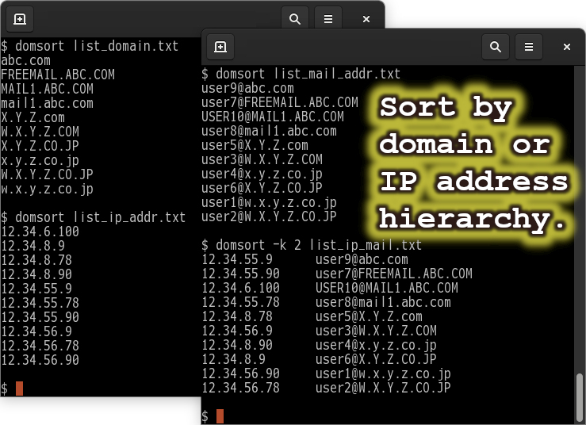

<!--- This file is auto-generated by `make catalog`. Do not edit manually. -->

* * *
# NAME

DOMSORT - Sort by domain or IP address hierarchy.

# SYNOPSIS

$ domsort \[_OPTIONS..._\] \[_FILE..._\]

# DESCRIPTION

Sort the list of domain names, email addresses, and IP addresses in tree order.

_FILE_s specifies the input file name.
If it is a standard input, "**-**" is given.

# OPTIONS

- -d

    Sort in phone book order (ignoring symbols).

- -f

    Force case sensitivity.

- -h, --help

    Display simple help and exit.

- -k _column_

    Specifies the _column_ to use for sorting.

- -r

    Reverse the result of comparisons.

- -t _SEP_

    Specify _SEP_ as the field separator.

- -v, --version

    Display script version, Perl version, and exit.

# ADVANCED USAGE

Sort by domain name

    $ cat <<__EOD__ | domsort -
    w.x.y.z.co.jp
    W.X.Y.Z.CO.JP
    W.X.Y.Z.COM
    mail2.abc.com
    mail1.abc.com
    mail1.abc.com
    abc.com
    freemail.abc.com
    a.b.c.d.co.jp
    a.b.c.co.jp
    X.Y.Z.com
    freemail.abc.com
    FREEMAIL.ABC.COM
    A.B.C.D.CO.JP
    x.y.z.co.jp
    X.Y.Z.com
    X.Y.Z.CO.JP
    freemail.abc.com
    x.y.z.com
    __EOD__
    abc.com
    FREEMAIL.ABC.COM
    freemail.abc.com
    freemail.abc.com
    freemail.abc.com
    mail1.abc.com
    mail1.abc.com
    mail2.abc.com
    X.Y.Z.com
    X.Y.Z.com
    x.y.z.com
    W.X.Y.Z.COM
    a.b.c.co.jp
    A.B.C.D.CO.JP
    a.b.c.d.co.jp
    X.Y.Z.CO.JP
    x.y.z.co.jp
    W.X.Y.Z.CO.JP
    w.x.y.z.co.jp

Case Sensitive (`-f`)

    $ cat <<__EOD__ | domsort -f -
    w.x.y.z.co.jp
    W.X.Y.Z.CO.JP
    W.X.Y.Z.COM
    mail2.abc.com
    mail1.abc.com
    mail1.abc.com
    abc.com
    freemail.abc.com
    a.b.c.d.co.jp
    a.b.c.co.jp
    X.Y.Z.com
    freemail.abc.com
    FREEMAIL.ABC.COM
    A.B.C.D.CO.JP
    x.y.z.co.jp
    X.Y.Z.com
    X.Y.Z.CO.JP
    freemail.abc.com
    x.y.z.com
    __EOD__
    FREEMAIL.ABC.COM
    W.X.Y.Z.COM
    A.B.C.D.CO.JP
    X.Y.Z.CO.JP
    W.X.Y.Z.CO.JP
    X.Y.Z.com
    X.Y.Z.com
    abc.com
    freemail.abc.com
    freemail.abc.com
    freemail.abc.com
    mail1.abc.com
    mail1.abc.com
    mail2.abc.com
    x.y.z.com
    a.b.c.co.jp
    a.b.c.d.co.jp
    x.y.z.co.jp
    w.x.y.z.co.jp

Sort by IP address

    $ cat <<__EOD__ | domsort -
    12.34.56.90
    12.34.56.78
    12.34.56.9
    12.34.55.90
    12.34.55.78
    12.34.55.9
    12.34.8.90
    12.34.8.78
    12.34.8.9
    __EOD__
    12.34.8.9
    12.34.8.78
    12.34.8.90
    12.34.55.9
    12.34.55.78
    12.34.55.90
    12.34.56.9
    12.34.56.78
    12.34.56.90

Specifying fields (`-k`)

    $ dig amazon.com. | grep '^amazon\.com\.' | domsort -k 5 -
    amazon.com.             347     IN      A       98.82.161.185
    amazon.com.             347     IN      A       98.87.170.71
    amazon.com.             347     IN      A       98.87.170.74
    $ dig yahoo.co.jp. | grep '^yahoo\.co\.jp\.' | domsort -k 5 -
    yahoo.co.jp.            40      IN      A       124.83.184.124
    yahoo.co.jp.            40      IN      A       124.83.184.252
    yahoo.co.jp.            40      IN      A       124.83.185.124
    yahoo.co.jp.            40      IN      A       124.83.185.252
    yahoo.co.jp.            40      IN      A       182.22.16.123
    yahoo.co.jp.            40      IN      A       182.22.16.251
    yahoo.co.jp.            40      IN      A       182.22.24.124
    yahoo.co.jp.            40      IN      A       182.22.24.252
    yahoo.co.jp.            40      IN      A       182.22.25.124
    yahoo.co.jp.            40      IN      A       182.22.25.252
    yahoo.co.jp.            40      IN      A       182.22.28.252
    yahoo.co.jp.            40      IN      A       182.22.31.124
    yahoo.co.jp.            40      IN      A       182.22.31.252
    yahoo.co.jp.            40      IN      A       183.79.219.124
    yahoo.co.jp.            40      IN      A       183.79.219.252
    yahoo.co.jp.            40      IN      A       183.79.249.124
    yahoo.co.jp.            40      IN      A       183.79.249.252
    yahoo.co.jp.            40      IN      A       183.79.250.251

Reverse order (`-r`)

    $ dig yahoo.co.jp. | grep '^yahoo\.co\.jp\.' | domsort -r -k 5 -
    yahoo.co.jp.            135     IN      A       183.79.250.251
    yahoo.co.jp.            135     IN      A       183.79.249.252
    yahoo.co.jp.            135     IN      A       183.79.249.124
    yahoo.co.jp.            135     IN      A       183.79.219.252
    yahoo.co.jp.            135     IN      A       183.79.219.124
    yahoo.co.jp.            135     IN      A       182.22.31.252
    yahoo.co.jp.            135     IN      A       182.22.31.124
    yahoo.co.jp.            135     IN      A       182.22.28.252
    yahoo.co.jp.            135     IN      A       182.22.25.252
    yahoo.co.jp.            135     IN      A       182.22.25.124
    yahoo.co.jp.            135     IN      A       182.22.24.252
    yahoo.co.jp.            135     IN      A       182.22.24.124
    yahoo.co.jp.            135     IN      A       182.22.16.251
    yahoo.co.jp.            135     IN      A       182.22.16.123
    yahoo.co.jp.            135     IN      A       124.83.185.252
    yahoo.co.jp.            135     IN      A       124.83.185.124
    yahoo.co.jp.            135     IN      A       124.83.184.252
    yahoo.co.jp.            135     IN      A       124.83.184.124

Sort by phone book order (ignoring symbols) (`-d`)

    $ cat <<__EOD__ | domsort -d -
    1234-5678
    03-1234-5678
    044-1234-568
    044-123-4567
    0123-111-222
    044-1234-566
    08-03-1234-5678
    __EOD__
    0123-111-222
    03-1234-5678
    044-1234-566
    044-123-4567
    044-1234-568
    08-03-1234-5678
    1234-5678

# DEPENDENCIES

This script uses only **core Perl modules**. No external modules from CPAN are required.

## Core Modules Used

- [File::Basename](https://metacpan.org/pod/File%3A%3ABasename) - first included in perl 5
- [strict](https://metacpan.org/pod/strict) - first included in perl 5
- [warnings](https://metacpan.org/pod/warnings) - first included in perl v5.6.0

## Survey methodology

- 1. Preparation

    Define the script name:

        $ target_script=domsort

- 2. Extract used modules

    Generate a list of modules from `use` statements:

        $ grep '^use ' $target_script | sed 's!^use \([^ ;{][^ ;{]*\).*$!\1!' | \
            sort | uniq | tee ${target_script}.uselist

- 3. Check core module status

    Run `corelist` for each module to find the first Perl version it appeared in:

        $ cat ${target_script}.uselist | while read line; do
            corelist $line
          done

# SEE ALSO

Other more basic references

- [perl](https://metacpan.org/pod/perl)(1)
- sort(1)

# AUTHOR

2005-2026, tomyama

# LICENSE

Copyright (c) 2005-2026, tomyama

All rights reserved.

Redistribution and use in source and binary forms, with or without
modification, are permitted provided that the following conditions are met:

1\. Redistributions of source code must retain the above copyright notice,
   this list of conditions and the following disclaimer.

2\. Redistributions in binary form must reproduce the above copyright notice,
   this list of conditions and the following disclaimer in the documentation
   and/or other materials provided with the distribution.

3\. Neither the name of tomyama nor the names of its contributors
   may be used to endorse or promote products derived from this software
   without specific prior written permission.

THIS SOFTWARE IS PROVIDED BY THE COPYRIGHT HOLDERS AND CONTRIBUTORS "AS IS"
AND ANY EXPRESS OR IMPLIED WARRANTIES, INCLUDING, BUT NOT LIMITED TO, THE
IMPLIED WARRANTIES OF MERCHANTABILITY AND FITNESS FOR A PARTICULAR PURPOSE ARE
DISCLAIMED. IN NO EVENT SHALL THE COPYRIGHT HOLDER OR CONTRIBUTORS BE LIABLE
FOR ANY DIRECT, INDIRECT, INCIDENTAL, SPECIAL, EXEMPLARY, OR CONSEQUENTIAL
DAMAGES (INCLUDING, BUT NOT LIMITED TO, PROCUREMENT OF SUBSTITUTE GOODS OR
SERVICES; LOSS OF USE, DATA, OR PROFITS; OR BUSINESS INTERRUPTION) HOWEVER
CAUSED AND ON ANY THEORY OF LIABILITY, WHETHER IN CONTRACT, STRICT LIABILITY,
OR TORT (INCLUDING NEGLIGENCE OR OTHERWISE) ARISING IN ANY WAY OUT OF THE USE
OF THIS SOFTWARE, EVEN IF ADVISED OF THE POSSIBILITY OF SUCH DAMAGE.

* * *
- See '[README.md](../README.md)' for installation instructions.
- See '[CATALOG.md](CATALOG.md)' for a list and overview of the scripts.
