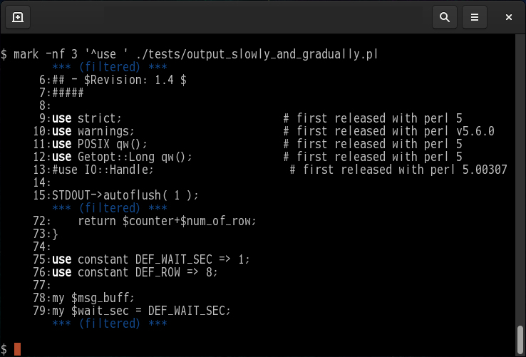

<!--- This file is auto-generated by `make catalog`. Do not edit manually. -->

* * *
# NAME

MARK - emphasizes part matching a pattern

# DESCRIPTION

The "**mark**" utility behaves like a marker pen.
It searches for the specified _PATTERN_ and emphasizes matching text.

# SYNOPSIS

$ mark \[_OPTIONS..._\] _PATTERN_ \[_FILE..._\]

$ mark --head-tail \[_OPTIONS..._\] \[_PATTERN_\] \[_FILE..._\]

## _PATTERN_

A Perl-compatible regular expression (PCRE).

## _FILE_

Input file name. Use **-** for standard input (stdin).

## _OPTIONS_

- -d, --debug

    Debugging mode is on.

- -f \[_before_\[,_after_\]\]

    Filter mode. Displays context lines _before_ and _after_ the match.
    Defaults to 5 lines _before_ and _after_ if values are omitted.
    If 0 is specified, only the matching lines are displayed.

- --head-tail

    Display mode. Shows only the beginning and end of the file.
    Automatically enables filter mode (`-f`). The number of lines displayed
    at the top and bottom of the file (or around matches) can be customized
    using the `-f` option (e.g., `-f 2,3`).
    When using this option, providing a _PATTERN_ is optional.

- -h, --no-filename

    Suppress the prefixing of filenames on output when multiple files are searched.

- -H, --with-filename

    Print the filename for each match.

- -i, --ignore-case

    Ignore case distinctions in the _PATTERN_.

- -n, --line-number

    Prefix each line of output with its line number within the file.

- -c, --force-color

    Enable highlighting even if STDOUT is not a TTY (e.g., pipes, redirects).

- -v, --version

    Print the version of this script and Perl, then exit.

- --help

    Display simple help and exit.

# ADVANCED USAGE

    $ rpm -qa | mark '-[0-9]+[a-z]?\..+$'

    $ mark '\b\d{1,3}(?:\.\d{1,3}){3}\b' /var/log/maillog

    $ mark -nf 5,0 '(ServerName|DocumentRoot|Log)\s+.*$' /etc/httpd/conf/httpd.conf

    $ mark -iHnf 0,10 '^[^\s].*$' *.{c,h}

    $ mark -ni '</?(table|tr|th|td)[^>]*>' index.html | S<less -R>

    $ man perlfunc | mark -nf 5,10 -i 'regular expr' | S<less -R>

    $ man awk | perl -ne 's/.\010//go; print' | S<mark -nf 0,3 '^[A-Z]'>

    $ tail -f /var/log/httpd/access_log | S<mark -f 0 '"(GET|POST) /(?:\S+(?:\.html|\.htm|/))? [^"]+"'>

    $ ls -tr /var/log/messages.?.gz | xargs gzip -dc | mark -ihf 10 'error' - /var/log/messages > /tmp/report.txt

# DEPENDENCIES

The minimum version of Perl required to run this script is Perl 5.14.0 or later.
If run on an older version, it will terminate safely with an error (specifically, a compilation error).

This script uses only **core Perl modules**. No external modules from CPAN are required.

## Core Modules Used

- [Errno](https://metacpan.org/pod/Errno) - first released with perl 5.005
- [Fcntl](https://metacpan.org/pod/Fcntl) - first released with perl 5
- [File::Basename](https://metacpan.org/pod/File%3A%3ABasename) — first included in perl 5
- [Getopt::Long](https://metacpan.org/pod/Getopt%3A%3ALong) - first released with perl 5
- [strict](https://metacpan.org/pod/strict) — first included in perl 5
- [warnings](https://metacpan.org/pod/warnings) — first included in perl v5.6.0

## Survey methodology

- 1. Preparation

    Define the script name:

        $ target_script=mark

- 2. Extract used modules

    Generate a list of modules from `use` statements:

        $ grep '^use ' $target_script | sed 's!^use \([^ ;{][^ ;{]*\).*$!\1!' | \
            sort | uniq | tee ${target_script}.uselist

- 3. Check core module status

    Run `corelist` for each module to find the first Perl version it appeared in:

        $ cat ${target_script}.uselist | while read line; do
            corelist $line
          done

# SEE ALSO

When you want to examine the regular expression,
please refer to an online manual of **Perl**.

- [`perlre(1)`](https://metacpan.org/pod/perlre%281%29)

    Perl regular expressions

- [`perlrequick(1)`](https://metacpan.org/pod/perlrequick%281%29)

    Perl regular expressions quick start

- [`perlreref(1)`](https://metacpan.org/pod/perlreref%281%29)

    Perl Regular Expressions Reference

- [`perlretut(1)`](https://metacpan.org/pod/perlretut%281%29)

    Perl regular expressions tutorial

- [`perlfaq6(1)`](https://metacpan.org/pod/perlfaq6%281%29)

    Regular Expressions

- [`regex(7)`](https://metacpan.org/pod/regex%287%29)

    POSIX 1003.2 regular expressions

Other more basic references

- [`perl(1)`](https://metacpan.org/pod/perl%281%29)
- [`grep(1)`](https://metacpan.org/pod/grep%281%29)

# AUTHOR

2006-2026, tomyama

# LICENSE

Copyright (c) 2006-2026, tomyama

All rights reserved.

Redistribution and use in source and binary forms, with or without
modification, are permitted provided that the following conditions are met:

1\. Redistributions of source code must retain the above copyright notice,
   this list of conditions and the following disclaimer.

2\. Redistributions in binary form must reproduce the above copyright notice,
   this list of conditions and the following disclaimer in the documentation
   and/or other materials provided with the distribution.

3\. Neither the name of tomyama nor the names of its contributors
   may be used to endorse or promote products derived from this software
   without specific prior written permission.

THIS SOFTWARE IS PROVIDED BY THE COPYRIGHT HOLDERS AND CONTRIBUTORS "AS IS"
AND ANY EXPRESS OR IMPLIED WARRANTIES, INCLUDING, BUT NOT LIMITED TO, THE
IMPLIED WARRANTIES OF MERCHANTABILITY AND FITNESS FOR A PARTICULAR PURPOSE ARE
DISCLAIMED. IN NO EVENT SHALL THE COPYRIGHT HOLDER OR CONTRIBUTORS BE LIABLE
FOR ANY DIRECT, INDIRECT, INCIDENTAL, SPECIAL, EXEMPLARY, OR CONSEQUENTIAL
DAMAGES (INCLUDING, BUT NOT LIMITED TO, PROCUREMENT OF SUBSTITUTE GOODS OR
SERVICES; LOSS OF USE, DATA, OR PROFITS; OR BUSINESS INTERRUPTION) HOWEVER
CAUSED AND ON ANY THEORY OF LIABILITY, WHETHER IN CONTRACT, STRICT LIABILITY,
OR TORT (INCLUDING NEGLIGENCE OR OTHERWISE) ARISING IN ANY WAY OUT OF THE USE
OF THIS SOFTWARE, EVEN IF ADVISED OF THE POSSIBILITY OF SUCH DAMAGE.

* * *
- See '[README.md](../README.md)' for installation instructions.
- See '[CATALOG.md](CATALOG.md)' for a list and overview of the scripts.
