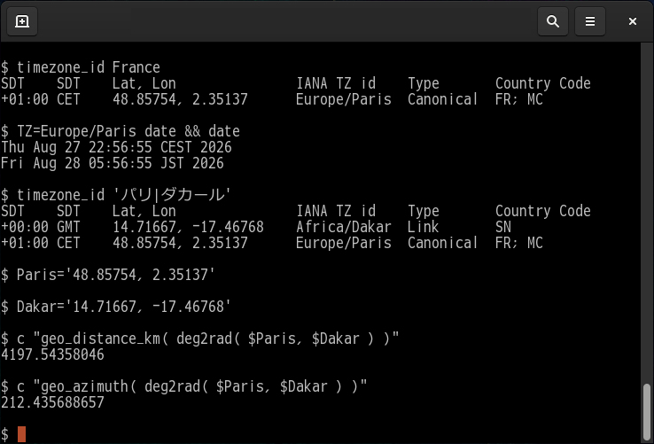

<!--- This file is auto-generated by `make catalog`. Do not edit manually. -->

* * *
# NAME

TIMEZONE\_ID -- List IANA timezone IDs.

# DESCRIPTION

This uses the data bundled with the script rather than the host system's time zone data.
This design was chosen because the goal was to use the data simply as regional information from around the world, without relying on the system.

The data (table) was created using IANA Timezone IDs as keys.
It does not contain information such as the dates for transitions between daylight saving time and standard time. Since this tool only identifies the ID itself, the assumption is that you will use other tools—such as the \`zdump\` command—to look up further details.

Note: How to list the time zone definitions implemented in the system

    Linux:
      $ timedatectl list-timezones

      $ tzselect

      $ find /usr/share/zoneinfo -type f

    Windows:
      > tzutil /l

    Mac:
      # systemsetup -listtimezones

Note: How to check when the time zone switches between daylight saving time and standard time:

    # If you want to check for Paris in 2025
    $ zdump -v -c 2025,2026 Europe/Paris
    Europe/Paris  -9223372036854775808 (gmtime failed) = -9223372036854775808 (localtime failed)
    Europe/Paris  -67768040609741362 (gmtime failed) = -67768040609741362 (localtime failed)
    Europe/Paris  -67768040609741361 (gmtime failed) = Mon Jan  1 00:00:00 -2147481748 LMT isdst=0 gmtoff=561
    Europe/Paris  -67768040609740801 (gmtime failed) = Mon Jan  1 00:09:20 -2147481748 LMT isdst=0 gmtoff=561
    Europe/Paris  Mon Jan  1 00:00:00 -2147481748 UT = Mon Jan  1 00:09:21 -2147481748 LMT isdst=0 gmtoff=561
    Europe/Paris  Sun Mar 30 00:59:59 2025 UT = Sun Mar 30 01:59:59 2025 CET isdst=0 gmtoff=3600
    Europe/Paris  Sun Mar 30 01:00:00 2025 UT = Sun Mar 30 03:00:00 2025 CEST isdst=1 gmtoff=7200
    Europe/Paris  Sun Oct 26 00:59:59 2025 UT = Sun Oct 26 02:59:59 2025 CEST isdst=1 gmtoff=7200
    Europe/Paris  Sun Oct 26 01:00:00 2025 UT = Sun Oct 26 02:00:00 2025 CET isdst=0 gmtoff=3600
    Europe/Paris  67768036191673199 (gmtime failed) = Wed Dec 31 23:59:59 2147485547 CET isdst=0 gmtoff=3600
    Europe/Paris  67768036191673200 (gmtime failed) = 67768036191673200 (localtime failed)
    Europe/Paris  9223372036854775807 (gmtime failed) = 9223372036854775807 (localtime failed)

# SYNOPSIS

$ timezone\_id \[ _OPTIONS_ \] \[ _PATTERN_... \]

# PATTERN

Each _PATTERN_ can be:

- Filter by a single keyword:

        $ timezone_id JST
        SDT    SDT    Lat, Lon               IANA TZ id  Type       Country Code
        +09:00 JST    +35.67642, +139.65002  Asia/Tokyo  Canonical  JP; AU
        +09:00 JST    +34.64938, +135.00147  Japan       Link       JP

- Specifying multiple keywords results in an AND condition:

        $ timezone_id 'America/' 'Fr'
        SDT    SDT    Lat, Lon               IANA TZ id           Type       Country Code
        −04:00 AST    +18.22083,  -66.59014  America/Puerto_Rico  Canonical  PR; AG; CA; AI; AW; BL; BQ; CW; DM; GD; GP; KN; LC; MF; MS; SX; TT; VC; VG; VI
        −04:00 AST    +18.06751,  -63.08246  America/Marigot      Link       MF
        −03:00 -3      +4.93797,  -52.33543  America/Cayenne      Canonical  GF

- Use a vertical bar (|) to specify multiple keywords with an OR condition:

        $ timezone_id 'France|French'
        SDT    SDT    Lat, Lon               IANA TZ id           Type       Country Code
        −10:00 -10    -17.65091, -149.42604  Pacific/Tahiti       Canonical  PF
        −09:30 -930    -9.78121, -139.08171  Pacific/Marquesas    Canonical  PF
        −09:00 -9     -23.10965, -134.97434  Pacific/Gambier      Canonical  PF
        −04:00 AST    +18.22083,  -66.59014  America/Puerto_Rico  Canonical  PR; AG; CA; AI; AW; BL; BQ; CW; DM; GD; GP; KN; LC; MF; MS; SX; TT; VC; VG; VI
        −04:00 AST    +18.06751,  -63.08246  America/Marigot      Link       MF
        −03:00 -3      +4.93797,  -52.33543  America/Cayenne      Canonical  GF
        +01:00 CET    +48.85754,   +2.35137  Europe/Paris         Canonical  FR; MC
        +04:00 +4     +25.20484,  +55.27078  Asia/Dubai           Canonical  AE; OM; RE; SC; TF
        +05:00 +5      +3.20277,  +73.22068  Indian/Maldives      Canonical  MV; TF
        +05:00 +5     -55.19908,  +76.10015  Indian/Kerguelen     Link       TF

# OPTIONS

- -b, --banner

    Show script banner.

- -d, --debug

    Enable debug output.

- -h, --help

    Display simple help and exit.

- -i, --ignorecase

    Ignore case distinctions in the _PATTERN_.

- --sort-order-by _FIELD\_NAME_

    `Lat`, `Lon`, and `ID` can be specified for _FIELD\_NAME_.
    By default, they are sorted by the magnitude of the offset time difference.

    Sort by longitude:

        $ timezone_id --sort-order-by 'Lon' 'Antarctica/' 'Link'
        SDT    SDT    Lat      ,  Lon        IANA TZ id                 Type       Country Code
        +12:00 NZST   -90      ,    0        Antarctica/South_Pole      Link       AQ
        +03:00 +3     -69.00439,  +39.5822   Antarctica/Syowa           Link       AQ
        +10:00 +10    -66.66359, +140.00325  Antarctica/DumontDUrville  Link       AQ
        +12:00 NZST   -77.84551, +166.66976  Antarctica/McMurdo         Link       AQ

- -v, --verbose

    Additional columns will be displayed.

        $ timezone_id 'Antarctica/' 'Link' --verbose
        SDT    SDT    DST    DST    Lat      ,  Lon        IANA TZ id                 Type       "Notes"  "Embedded comments"  "Country Code"  "Country Name"  ""
        +03:00 +3     +03:00 +3     -69.00439,  +39.5822   Antarctica/Syowa           Link       "Link to Asia/Riyadh"  "Syowa"  "AQ"  "Antarctica"  ""
        +10:00 +10    +10:00 +10    -66.66359, +140.00325  Antarctica/DumontDUrville  Link       "Link to Pacific/Port_Moresby"  "Dumont-d'Urville"  "AQ"  "Antarctica"  ""
        +12:00 NZST   +13:00 NZDT   -77.84551, +166.66976  Antarctica/McMurdo         Link       "Link to Pacific/Auckland"  "New Zealand time – McMurdo, South Pole"  "AQ"  "Antarctica"  ""
        +12:00 NZST   +13:00 NZDT   -90      ,    0        Antarctica/South_Pole      Link       "Link to Pacific/Auckland"  ""  "AQ"  "Antarctica"  ""

    If LC\_CTYPE is set to `ja_JP.UTF-8`, Japanese information will also be displayed.

        $ timezone_id 'Antarctica/' 'Link' --verbose
        SDT    SDT    DST    DST    Lat      ,  Lon        IANA TZ id                 Type       "Notes"  "Embedded comments"  "Country Code"  "Country Name"  "Countries"  ID
        +03:00 +3     +03:00 +3     -69.00439,  +39.5822   Antarctica/Syowa           Link       "Link to Asia/Riyadh"  "Syowa"  "AQ"  "Antarctica"  "南極大陸"  南極大陸/昭和基地
        +10:00 +10    +10:00 +10    -66.66359, +140.00325  Antarctica/DumontDUrville  Link       "Link to Pacific/Port_Moresby"  "Dumont-d'Urville"  "AQ"  "Antarctica"  "南極大陸"  南極大陸/デュモン・デュルヴィル基地
        +12:00 NZST   +13:00 NZDT   -77.84551, +166.66976  Antarctica/McMurdo         Link       "Link to Pacific/Auckland"  "New Zealand time – McMurdo, South Pole"  "AQ"  "Antarctica"  "南極大陸"  南極大陸/マクマード基地
        +12:00 NZST   +13:00 NZDT   -90      ,    0        Antarctica/South_Pole      Link       "Link to Pacific/Auckland"  ""  "AQ"  "Antarctica"  "南極大陸"  南極大陸/南極点

- --version

    Print the version of this script and Perl and exit.

# ADVANCED USAGE

- Run the clock set to French time.

    Search for France's time zone:

        $ timezone_id France
        SDT    SDT    Lat, Lon               IANA TZ id    Type       Country Code
        +01:00 CET    48.85754, 2.35137      Europe/Paris  Canonical  FR; MC

    Change the time zone only for the duration of execution: (shell feature)

        $ TZ='Europe/Paris' date && date
        Sat Aug 22 18:06:02 CEST 2026
        Sun Aug 23 01:06:02 JST 2026

    Run the clock:

        $ TZ='Europe/Paris' cl

    Using latitude and longitude in a `c script`:

        $ timezone_id 'Tokyo|Paris'
        SDT    SDT    Lat      ,  Lon        IANA TZ id     Type       Country Code
        +01:00 CET    +48.85754,   +2.35137  Europe/Paris   Canonical  FR; MC
        +01:00 CET    +43.73841,   +7.42461  Europe/Monaco  Link       MC
        +09:00 JST    +35.67642, +139.65002  Asia/Tokyo     Canonical  JP; AU
        +09:00 JST    +34.64938, +135.00147  Japan          Link       JP

        $ Paris='+48.85754,   +2.35137'
        $ Tokyo='+35.67642, +139.65002'

        # What's the distance?
        $ c "geo_distance_km( deg2rad( $Paris, $Tokyo ) )"
        9735.22180919

        # Which direction?
        $ c "geo_azimuth( deg2rad( $Paris, $Tokyo ) )"
        33.4304455215
        # Since the Earth is a sphere, the shortest route (great-circle route)
        # follows a northerly course passing near the North Pole.

# DEPENDENCIES

This script uses only **core Perl modules**. No external modules from CPAN are required.

## Core Modules Used

- [constant](https://metacpan.org/pod/constant) - first released with perl 5.004
- [Encode](https://metacpan.org/pod/Encode) - first released with perl v5.7.3
- [File::Basename](https://metacpan.org/pod/File%3A%3ABasename) — first included in perl 5
- [Getopt::Long](https://metacpan.org/pod/Getopt%3A%3ALong) - first released with perl 5
- [POSIX](https://metacpan.org/pod/POSIX) - first released with perl 5
- [strict](https://metacpan.org/pod/strict) — first included in perl 5
- [utf8](https://metacpan.org/pod/utf8) - first released with perl v5.6.0
- [warnings](https://metacpan.org/pod/warnings) — first included in perl v5.6.0

## Survey methodology

- 1. Preparation

    Define the script name:

        $ target_script=timezone_id

- 2. Extract used modules

    Generate a list of modules from `use` statements:

        $ grep '^use ' $target_script | sed 's!^use \([^ ;{][^ ;{]*\).*$!\1!' | \
            sort | uniq | tee ${target_script}.uselist

- 3. Check core module status

    Run `corelist` for each module to find the first Perl version it appeared in:

        $ cat ${target_script}.uselist | while read line; do
            corelist $line
          done

# SEE ALSO

- [`c -- The Flat-Text Calculator (Perl Script)`](https://github.com/tomyama-code/tomyama_script_collection/blob/main/docs/c.md)
- [`cl -- CLOCK PROGRAM`](https://github.com/tomyama-code/tomyama_script_collection/blob/main/docs/cl.md)
- [`perl(1)`](https://metacpan.org/pod/perl%281%29)

# AUTHOR

2026, tomyama

# LICENSE

Copyright (c) 2026, tomyama

All rights reserved.

Redistribution and use in source and binary forms, with or without
modification, are permitted provided that the following conditions are met:

1\. Redistributions of source code must retain the above copyright notice,
   this list of conditions and the following disclaimer.

2\. Redistributions in binary form must reproduce the above copyright notice,
   this list of conditions and the following disclaimer in the documentation
   and/or other materials provided with the distribution.

3\. Neither the name of tomyama nor the names of its contributors
   may be used to endorse or promote products derived from this software
   without specific prior written permission.

THIS SOFTWARE IS PROVIDED BY THE COPYRIGHT HOLDERS AND CONTRIBUTORS "AS IS"
AND ANY EXPRESS OR IMPLIED WARRANTIES, INCLUDING, BUT NOT LIMITED TO, THE
IMPLIED WARRANTIES OF MERCHANTABILITY AND FITNESS FOR A PARTICULAR PURPOSE ARE
DISCLAIMED. IN NO EVENT SHALL THE COPYRIGHT HOLDER OR CONTRIBUTORS BE LIABLE
FOR ANY DIRECT, INDIRECT, INCIDENTAL, SPECIAL, EXEMPLARY, OR CONSEQUENTIAL
DAMAGES (INCLUDING, BUT NOT LIMITED TO, PROCUREMENT OF SUBSTITUTE GOODS OR
SERVICES; LOSS OF USE, DATA, OR PROFITS; OR BUSINESS INTERRUPTION) HOWEVER
CAUSED AND ON ANY THEORY OF LIABILITY, WHETHER IN CONTRACT, STRICT LIABILITY,
OR TORT (INCLUDING NEGLIGENCE OR OTHERWISE) ARISING IN ANY WAY OUT OF THE USE
OF THIS SOFTWARE, EVEN IF ADVISED OF THE POSSIBILITY OF SUCH DAMAGE.

* * *
- See '[README.md](../README.md)' for installation instructions.
- See '[CATALOG.md](CATALOG.md)' for a list and overview of the scripts.
